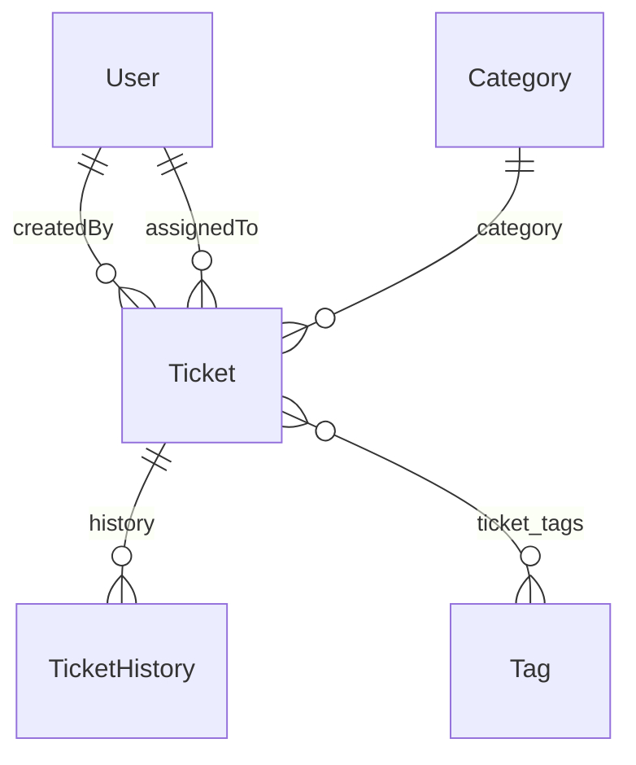

# Guía Rápida — DSY1103 Fullstack I Backend

> **Stack:** Spring Boot 4.0.5 · Java 21 · Maven  
> **Base URL:** `http://localhost:8080/ticket-app`  
> **Repositorio:** DSY1103-FULLSTACK-I-BACKEND

---

## 1. Tabla de Proyectos

| Proyecto | Lección | Novedad Clave |
|----------|---------|---------------|
| `Tickets/` | base | CRUD in-memory con HashMap |
| `Tickets-10/` | 10 | JPA + H2 (migración a BD) |
| `Tickets-11/` | 11 | Perfiles MySQL + PostgreSQL |
| `Tickets-12/` | 12 | Entidad User + @ManyToOne |
| `Tickets-13/` | 13 | TicketHistory (auditoría automática) |
| `Tickets-14/` | 14 | RestClient + FeignClient (microservicios) |
| `Tickets-15/` | 15 | Flyway + Category + Tag |
| `Tickets-16/` | 16 | Spring Security (HTTP Basic, roles) |
| `Tickets-17/` | 17 | @Slf4j logging |
| `Tickets-18/` | 18 | @ControllerAdvice (Global Exception Handler) |

---

## 2. Arquitectura

```
Cliente HTTP
    ↓
Controller Layer → @Valid, ResponseEntity, rutas REST
    ↓
Service Layer → Reglas de negocio, coordinación, mapeo DTO↔Entity
    ↓
Respository Layer → JpaRepository, queries @Query, métodos derivados
    ↓
Database (H2 / MySQL / PostgreSQL)
```

**5 capas:** `controller/` → `service/` → `respository/` → `model/` + `dto/`

Paquetes adicionales: `config/` (Security, Feign, ExceptionHandler), `client/` (FeignClient, RestClient)

> ⚠️ `respository/` sin la letra 'o' es intencional

---

## 3. Endpoints Completos

### 3.1 Tickets (`/ticket-app/tickets`)

| Método | Ruta | Roles | Body | Respuesta | Códigos |
|--------|------|-------|------|-----------|---------|
| GET | `/tickets` | USER, AGENT, ADMIN | — | `List<TicketResult>` | 200 |
| GET | `/tickets?status=NEW` | USER, AGENT, ADMIN | — | `List<TicketResult>` | 200 |
| POST | `/tickets` | USER, AGENT, ADMIN | `TicketRequest` | `TicketResult` | 201, 400, 409 |
| GET | `/tickets/by-id/{id}` | USER, AGENT, ADMIN | — | `TicketResult` | 200, 404 |
| PUT | `/tickets/by-id/{id}` | USER, AGENT, ADMIN | `TicketRequest` | `TicketResult` | 200, 404, 400 |
| DELETE | `/tickets/by-id/{id}` | USER, AGENT, ADMIN | — | — | 204, 404 |
| GET | `/tickets/{id}/history` | USER, AGENT, ADMIN | — | `List<TicketHistoryResult>` | 200 |

### 3.2 Users (`/ticket-app/users`)

| Método | Ruta | Roles | Body | Respuesta | Códigos |
|--------|------|-------|------|-----------|---------|
| GET | `/users` | ADMIN | — | `List<UserResult>` | 200 |
| POST | `/users` | ADMIN | `UserRequest` | `UserResult` | 201, 409 |
| GET | `/users/by-id/{id}` | ADMIN | — | `UserResult` | 200, 404 |

### 3.3 Categories (`/ticket-app/categories`)

| Método | Ruta | Roles | Body | Respuesta | Códigos |
|--------|------|-------|------|-----------|---------|
| GET | `/categories` | ADMIN | — | `List<Category>` | 200 |
| GET | `/categories/by-id/{id}` | ADMIN | — | `Category` | 200, 404 |
| POST | `/categories` | ADMIN | `CategoryRequest` | `"Category Created"` | 201, 400 |
| PUT | `/categories/by-id/{id}` | ADMIN | `CategoryRequest` | `"Category Updated"` | 200, 404, 400 |
| DELETE | `/categories/by-id/{id}` | ADMIN | — | — | 204, 404 |

### 3.4 Tags (`/ticket-app/tags`)

| Método | Ruta | Roles | Body | Respuesta | Códigos |
|--------|------|-------|------|-----------|---------|
| GET | `/tags` | ADMIN | — | `List<Tag>` | 200 |
| GET | `/tags/by-id/{id}` | ADMIN | — | `Tag` | 200, 404 |
| POST | `/tags` | ADMIN | `TagRequest` | `"Tag Created"` | 201, 400 |
| PUT | `/tags/by-id/{id}` | ADMIN | `TagRequest` | `"Tag Updated"` | 200, 404, 400 |
| DELETE | `/tags/by-id/{id}` | ADMIN | — | — | 204, 404 |

---

## 4. Modelo de Datos



### Entidad User
| Campo | Tipo | Restricciones |
|-------|------|---------------|
| id | Long | PK, auto-increment |
| name | String | @NotBlank, max 100 |
| email | String | @Email, unique, max 150 |
| role | Enum (USER/AGENT/ADMIN) | default USER |
| active | boolean | default true |

### Entidad Ticket
| Campo | Tipo | Restricciones |
|-------|------|---------------|
| id | Long | PK, auto-increment |
| title | String | @NotBlank @Size(max=50) |
| description | String | @NotBlank |
| status | String | — |
| createdAt | LocalDateTime | — |
| estimatedResolutionDate | LocalDate | — |
| effectiveResolutionDate | LocalDateTime | nullable |
| createdBy | @ManyToOne → User | FK: created_by_id |
| assignedTo | @ManyToOne → User | FK: assigned_to_id |
| category | @ManyToOne → Category | FK: category_id |
| tags | @ManyToMany → Tag | tabla: ticket_tags |

### Entidad TicketHistory
| Campo | Tipo | Restricciones |
|-------|------|---------------|
| id | Long | PK, auto-increment |
| ticket | @ManyToOne → Ticket | FK: ticket_id, not null |
| previousStatus | String | nullable (null = creación) |
| newStatus | String | not null |
| changedAt | LocalDateTime | not null |
| comment | String | max 255 |

### Entidad Category
| Campo | Tipo | Restricciones |
|-------|------|---------------|
| id | Long | PK, auto-increment |
| name | String | unique |
| description | String | nullable |
| tickets | @OneToMany → Ticket | mappedBy |

### Entidad Tag
| Campo | Tipo | Restricciones |
|-------|------|---------------|
| id | Long | PK, auto-increment |
| name | String | unique |
| color | String | nullable (ej: "#ff0000") |
| tickets | @ManyToMany → Ticket | mappedBy |

---

## 5. Seguridad

### 5.1 Roles y Acceso

| Rol | Tickets | Users | Categories | Tags |
|-----|---------|-------|------------|------|
| USER | ✅ CRUD | ❌ | ❌ | ❌ |
| AGENT | ✅ CRUD | ❌ | ❌ | ❌ |
| ADMIN | ✅ CRUD | ✅ CRUD | ✅ CRUD | ✅ CRUD |

### 5.2 Usuarios Seed

| Email | Rol | Contraseña |
|-------|-----|------------|
| `admin@tickets.com` | ADMIN | (vacío) |
| `agent@tickets.com` | AGENT | (vacío) |
| `john@tickets.com` | USER | (vacío) |

### 5.3 Autenticación

HTTP Basic: `Authorization: Basic base64(email:)`

```bash
curl -u "admin@tickets.com:" http://localhost:8080/ticket-app/tickets
```

### 5.4 Código de Configuración

```java
.authorizeHttpRequests(auth -> auth
    .requestMatchers("/tickets/**").hasAnyRole("USER", "AGENT", "ADMIN")
    .requestMatchers("/users/**").hasRole("ADMIN")
    .requestMatchers("/categories/**").hasRole("ADMIN")
    .requestMatchers("/tags/**").hasRole("ADMIN")
    .anyRequest().permitAll()
)
.httpBasic(basic -> {});
```

---

## 6. Configuración

### 6.1 Perfiles

| Perfil | Base de datos | ddl-auto | Flyway |
|--------|---------------|----------|--------|
| `h2` (default) | H2 in-memory | create-drop | disabled |
| `mysql` | MySQL | validate | enabled |
| `supabase` | PostgreSQL | validate | enabled |

### 6.2 application.yml (base)

```yaml
server:
  port: 8080
  servlet:
    context-path: "/ticket-app"
```

### 6.3 Ejecución por Perfil

```bash
# H2 (default)
mvnw.cmd spring-boot:run

# MySQL
mvnw.cmd spring-boot:run -Dspring-boot.run.profiles=mysql

# Supabase
mvnw.cmd spring-boot:run -Dspring-boot.run.profiles=supabase
```

### 6.4 Variables de Entorno Requeridas

```bash
# MySQL
DB_URL=jdbc:mysql://localhost:3306/tickets_db?useSSL=false
DB_USER=root
DB_PASSWORD=

# Supabase
DB_URL=jdbc:postgresql://db.example.supabase.co:5432/postgres
DB_USER=postgres
DB_PASSWORD=your_password
```

---

## 7. Microservicios

| Servicio | Puerto | Endpoints | Propósito |
|----------|--------|-----------|-----------|
| NotificationService | 8081 | POST/GET `/api/notifications` | Enviar notificaciones |
| AuditService | 8082 | POST/GET `/api/audit`, GET `/api/audit/ticket/{id}` | Auditoría de tickets |
| SearchService | 8084 | POST `/api/search/index`, GET `/api/search?q=`, GET `/api/search/ticket/{id}` | Búsqueda full-text |
| SLAService | 8085 | POST `/api/sla/start`, GET/PUT `/api/sla/{id}` | Control de SLA |

Todos usan `spring-boot-starter-web` + almacenamiento in-memory (`ConcurrentHashMap`).

---

## 8. Patrones de Código

### 8.1 CRUD Service

```java
@Service
public class XxxService {
    private final XxxRepository repository;

    public XxxService(XxxRepository repository) { this.repository = repository; }

    public List<XxxResult> getAll() {
        return repository.findAll().stream().map(this::toResult).toList();
    }

    public XxxResult create(XxxRequest request) {
        if (repository.existsByXxx(request.xxx()))
            throw new IllegalArgumentException("Ya existe...");
        Xxx entity = new Xxx();
        entity.setXxx(request.xxx());
        return toResult(repository.save(entity));
    }

    public Optional<XxxResult> getById(Long id) {
        return repository.findById(id).map(this::toResult);
    }

    public boolean deleteById(Long id) {
        if (repository.existsById(id)) { repository.deleteById(id); return true; }
        return false;
    }

    private XxxResult toResult(Xxx entity) {
        return new XxxResult(entity.getId(), entity.getXxx());
    }
}
```

### 8.2 FeignClient

```java
@FeignClient(name = "service", url = "${service.url:http://localhost:xxxx}")
public interface ServiceClient {
    @PostMapping("/api/endpoint")
    Map<String, Object> doSomething(@RequestBody Map<String, String> data);
}
```

### 8.3 RestClient

```java
@Component
public class MyRestClient {
    private final RestClient restClient;

    public MyRestClient() {
        this.restClient = RestClient.builder()
            .baseUrl("http://localhost:xxxx").build();
    }

    public Map<String, Object> callEndpoint(Map<String, String> data) {
        try {
            return restClient.post().uri("/api/endpoint")
                .body(data).retrieve().body(Map.class);
        } catch (Exception e) {
            return Map.of("status", "fallback");
        }
    }
}
```

### 8.4 Global Exception Handler

```java
@ControllerAdvice
@Slf4j
public class GlobalExceptionHandler {
    @ExceptionHandler(IllegalArgumentException.class)
    public ResponseEntity<?> handleBadRequest(IllegalArgumentException e) {
        log.warn("Validación: {}", e.getMessage());
        return ResponseEntity.badRequest().body(new ErrorResponse(e.getMessage()));
    }

    @ExceptionHandler(Exception.class)
    public ResponseEntity<?> handleGeneric(Exception e) {
        log.error("Error interno", e);
        return ResponseEntity.status(500).body(new ErrorResponse("Error interno"));
    }
}
```

### 8.5 Security Filter Chain

```java
@Bean
public SecurityFilterChain filterChain(HttpSecurity http) throws Exception {
    http
        .csrf(AbstractHttpConfigurer::disable)
        .sessionManagement(s -> s.sessionCreationPolicy(SessionCreationPolicy.STATELESS))
        .authorizeHttpRequests(auth -> auth
            .requestMatchers("/tickets/**").hasAnyRole("USER", "AGENT", "ADMIN")
            .requestMatchers("/admin/**").hasRole("ADMIN")
            .anyRequest().permitAll()
        )
        .httpBasic(basic -> {});
    return http.build();
}
```

---

## 9. Comandos

```bash
# Ejecutar proyecto
mvnw.cmd spring-boot:run

# Perfiles
mvnw.cmd spring-boot:run -Dspring-boot.run.profiles=mysql

# Compilar
mvnw.cmd compile

# Tests
mvnw.cmd test
mvnw.cmd test -Dtest=ClaseTest

# Package
mvnw.cmd package -DskipTests

# Limpiar
mvnw.cmd clean
```

---

> **DSY1103 Fullstack I Backend** — Guía Rápida  
> Generado desde el repositorio DSY1103-FULLSTACK-I-BACKEND
