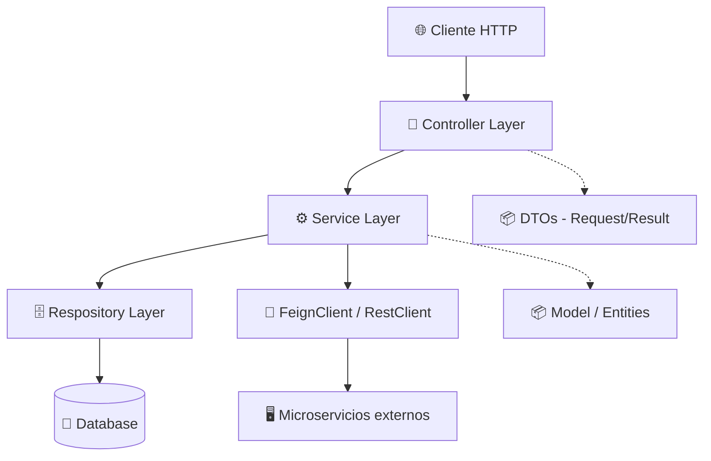
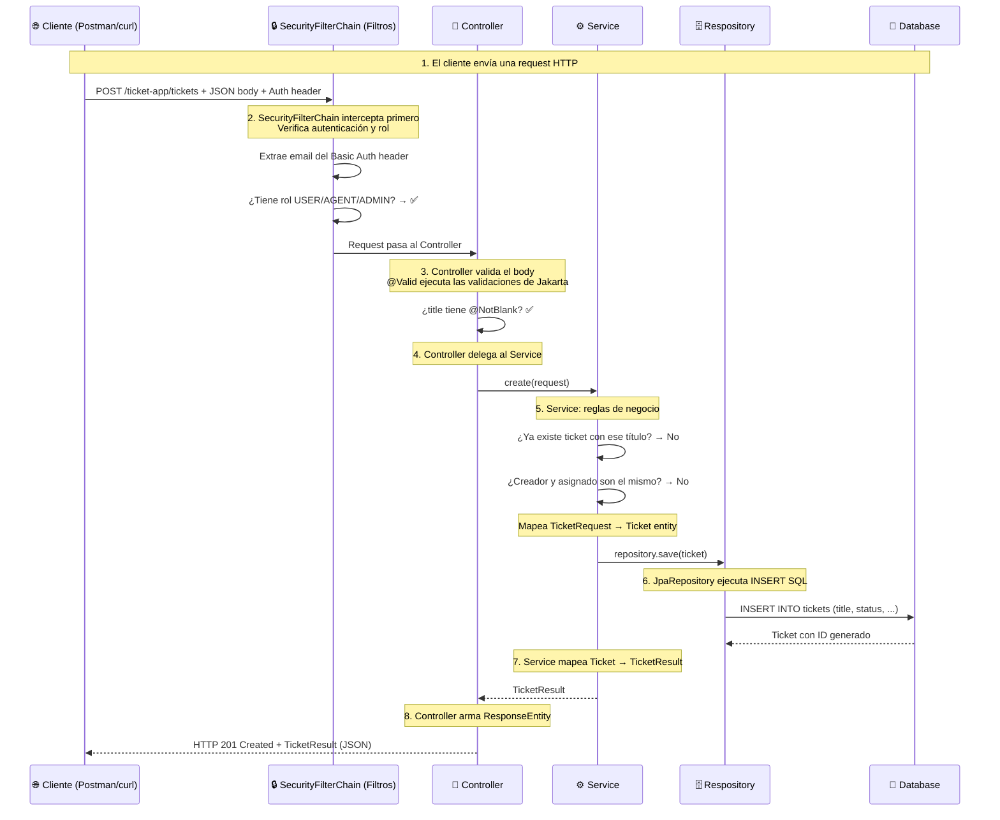
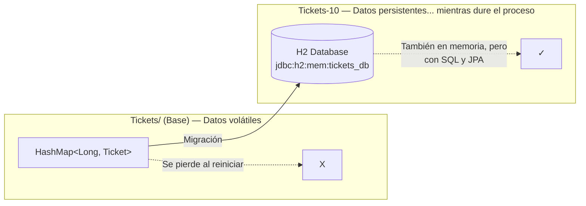
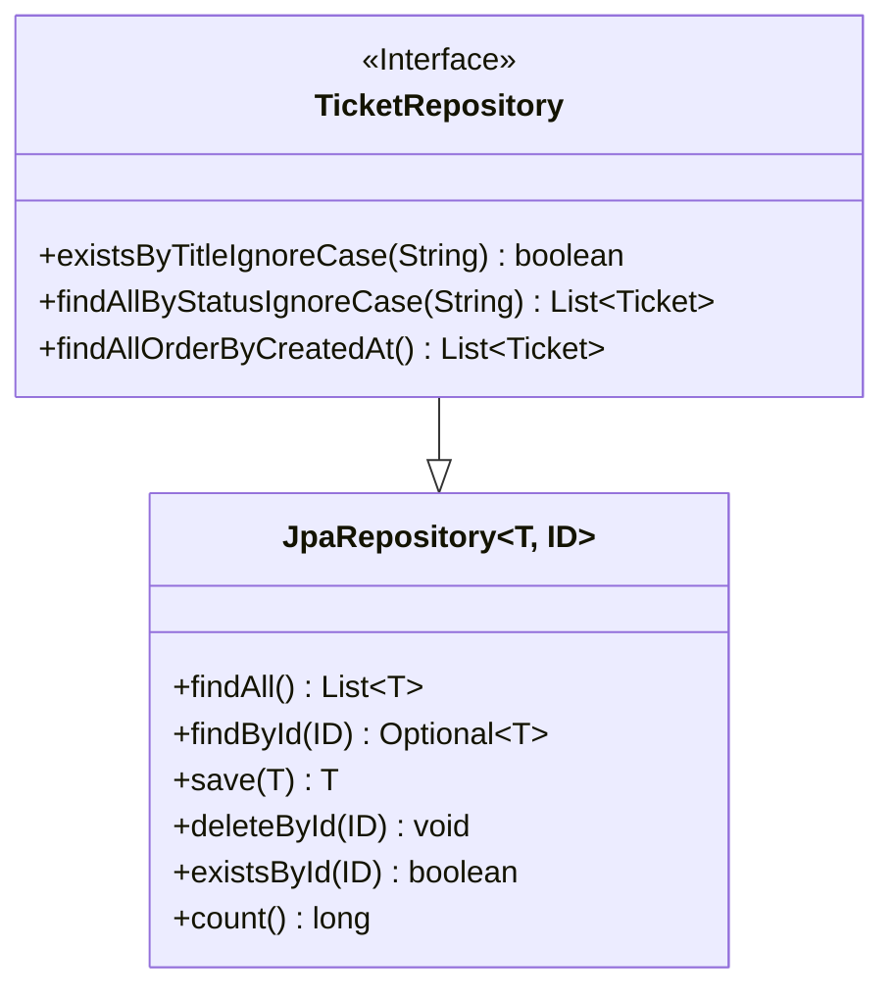
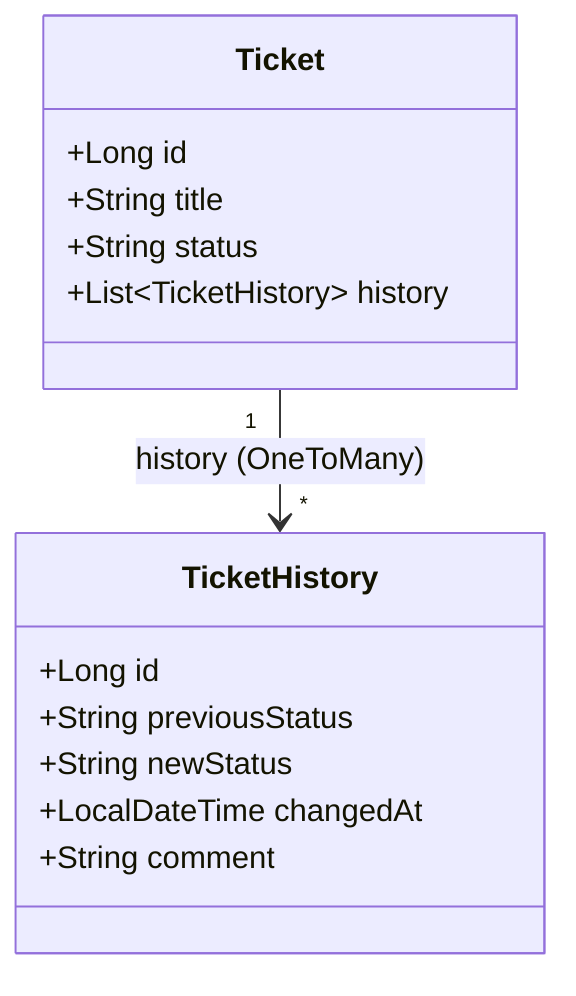
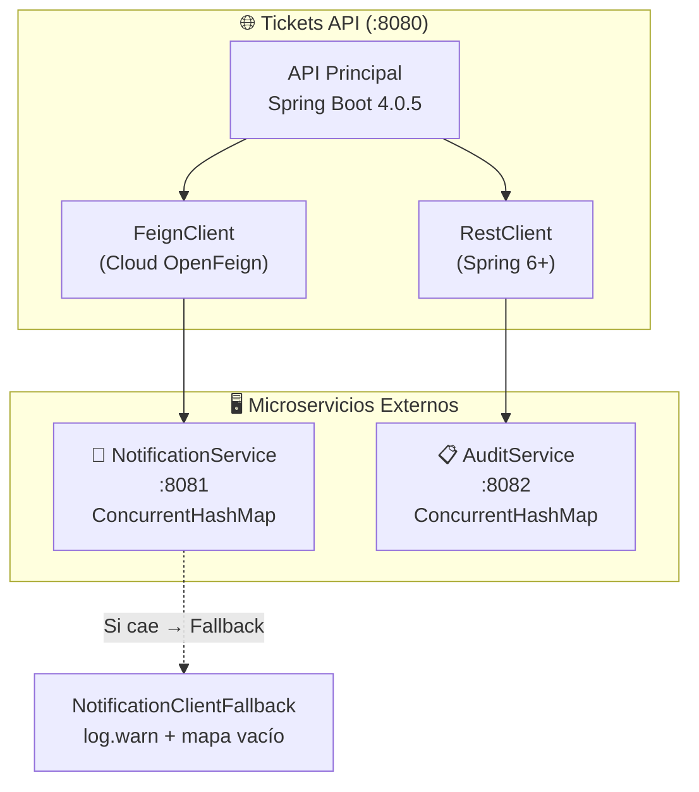
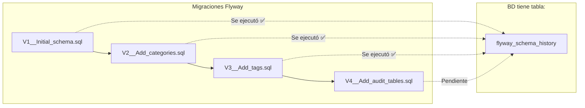
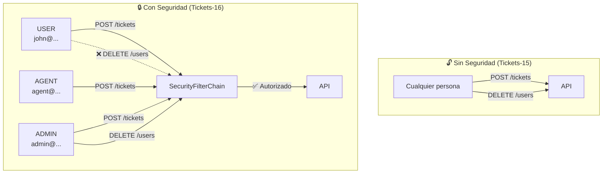
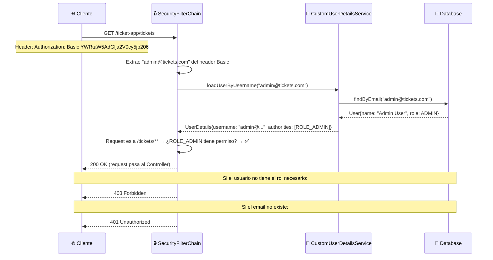
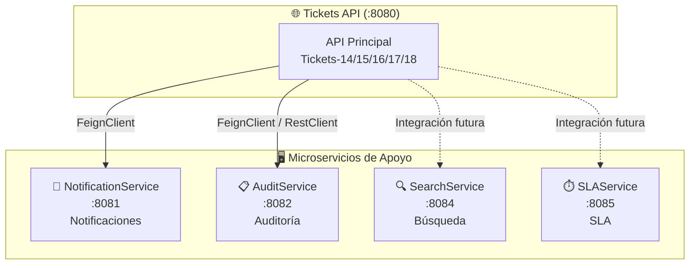

# Manual de Estudio — DSY1103 Fullstack I Backend

> **Curso:** Fullstack I — Backend  
> **Stack:** Spring Boot 4.0.5 · Java 21 · Maven  
> **Repositorio:** DSY1103-FULLSTACK-I-BACKEND  
> **Actualizado:** Marzo 2026

---

## 📑 Índice

| # | Sección | Descripción |
|---|---------|-------------|
| 1 | [Introducción](#1-introduccion) | Propósito, stack, estructura, convenciones |
| 2 | [Arquitectura General](#2-arquitectura-general) | Patrón 5 capas, flujo request/respuesta, responsabilidades |
| 3 | [Tickets/ — Base (Sin BD)](#3-tickets--base-sin-bd) | CRUD in-memory con HashMap — punto de partida |
| 4 | [Tickets-10 — JPA + H2](#4-tickets-10--jpa--h2) | Migración a base de datos relacional con JPA |
| 5 | [Tickets-11 — Múltiples Bases de Datos](#5-tickets-11--multiples-bases-de-datos) | Perfiles Spring: H2, MySQL, PostgreSQL |
| 6 | [Tickets-12 — Entidad User](#6-tickets-12--entidad-user) | Relaciones @ManyToOne entre entidades |
| 7 | [Tickets-13 — Ticket History](#7-tickets-13--ticket-history) | Auditoría automática con TicketHistory |
| 8 | [Tickets-14 — Microservicios](#8-tickets-14--microservicios-restclient--feign) | RestClient + FeignClient, degradación graceful |
| 9 | [Tickets-15 — Flyway + Categorías y Tags](#9-tickets-15--flyway--categorias-y-tags) | Migraciones versionadas, @ManyToMany |
| 10 | [Tickets-16 — Spring Security](#10-tickets-16--spring-security) | HTTP Basic, roles, CustomUserDetailsService |
| 11 | [Tickets-17 — Logging con @Slf4j](#11-tickets-17--logging-con-slf4j) | SLF4J, niveles, configuración |
| 12 | [Tickets-18 — Global Exception Handler](#12-tickets-18--global-exception-handler) | @ControllerAdvice, manejo centralizado de errores |
| 13 | [Modelo de Datos Final](#13-modelo-de-datos-final) | ER completo, entidades, relaciones, config final |
| 14 | [Microservicios de Apoyo](#14-microservicios-de-apoyo) | Notification, Audit, Search, SLA — código completo |
| 15 | [Extras Resumidos](#15-extras--material-de-apoyo-resumido) | 18 temas de apoyo con tiempos estimados |
| 16 | [Apéndice: Comandos](#16-apendice-comandos-utiles) | Maven, perfiles, curl, variables de entorno |

---

## 1. Introducción

### 🎯 Propósito del Repositorio

Este repositorio documenta el avance progresivo del curso **DSY1103 Fullstack I Backend**, donde cada lección produce un snapshot funcional del proyecto **Tickets** — una API REST de gestión de tickets de soporte.

Cada carpeta `Tickets-N/` es un proyecto Spring Boot independiente y completamente funcional. La numeración refleja el orden de las lecciones, de la más simple a la más completa. Puedes abrir cualquier `Tickets-N/` en IntelliJ IDEA y ejecutarlo inmediatamente.

> 💡 **Cómo estudiar:** Sigue el orden numérico. Cada proyecto construye sobre el anterior — no te saltes ninguno. Si entiendes la base (Tickets/), entender cómo se añade JPA (Tickets-10) es mucho más fácil.

---

### 🛠️ Stack Tecnológico — ¿Qué es cada cosa?

| Componente | Versión | ¿Qué hace? |
|------------|---------|------------|
| **Spring Boot** | 4.0.5 | Framework que "autoconfigura" todo: embedded Tomcat, conexión a BD, seguridad. Sin Spring Boot, tendrías que configurar manualmente un servidor web, un pool de conexiones, etc. |
| **Java** | 21 LTS | Lenguaje base. Versión 21 es la más reciente LTS (Long Term Support) — tiene records, pattern matching, lambdas, streams |
| **Maven** | 3.x | Build tool: compila, maneja dependencias, ejecuta tests. El wrapper (`mvnw.cmd`) evita tener que instalar Maven |
| **H2** | — | BD en memoria para desarrollo — no requiere instalación, se borra al apagar |
| **MySQL / PostgreSQL** | — | Bases de datos para producción. MySQL se usa con XAMPP local, PostgreSQL con Supabase (nube) |
| **Spring Data JPA** | — | Abstracción sobre Hibernate: permite operaciones de BD escribiendo interfaces, no implementaciones |
| **Hibernate** | — | ORM (Object-Relational Mapping): convierte filas de tablas en objetos Java automáticamente |
| **Flyway** | — | Versiona los cambios de esquema de BD como archivos SQL — como Git para la base de datos |
| **Spring Security** | — | Framework de autenticación y autorización — protege endpoints según roles |
| **OpenFeign** | 5.0.1 | Cliente HTTP declarativo: defines una interfaz y Feign implementa las llamadas HTTP |
| **RestClient** | (Spring 6+) | Cliente HTTP programático: control total sobre requests y manejo de errores |

---

### 📂 Estructura de un Proyecto Tickets-N — ¿Qué hace cada carpeta?

```
Tickets-N/
├── pom.xml                           # Declaración de dependencias y plugins de Maven
├── mvnw / mvnw.cmd                   # Maven Wrapper — no necesitas instalar Maven
├── src/
│   ├── main/java/cl/duoc/fullstack/tickets/
│   │   ├── TicketsApplication.java       # Punto de entrada: @SpringBootApplication
│   │   ├── controller/                   # Capa HTTP: endpoints REST @RestController
│   │   ├── service/                      # Capa de negocio: reglas, coordinación, mapeos
│   │   ├── respository/                  # ⚠️ Typografía intencional (sin 'o')
│   │   │                                 # Capa de datos: interfaces JpaRepository
│   │   ├── model/                        # Entidades JPA que mapean a tablas de BD
│   │   ├── dto/                          # Records Java: contratos de entrada/salida
│   │   ├── config/                       # Beans de configuración: Security, Feign, Errors
│   │   └── client/                       # Clientes HTTP para microservicios externos
│   └── main/resources/
│       ├── application.yml               # Config base (puerto, context-path)
│       ├── application-{perfil}.yml      # Config por perfil (h2, mysql, supabase)
│       └── db/migration/                 # Migraciones Flyway versionadas (V1-V4)
└── README.md
```

> ⚠️ **El paquete `respository/`** (sin la letra 'o') es intencional. No lo "corrijas" al crear archivos — es una convención del curso.

---

### 📋 Convenciones del Proyecto — ¿Por qué así?

| Convención | Explicación |
|------------|-------------|
| Context path `/ticket-app` | Todas las rutas tienen este prefijo: `http://localhost:8080/ticket-app/tickets` |
| DTOs como **records** | Los records de Java son **inmutables** por diseño — una vez creados, no pueden modificarse. Ideales para contratos de API donde no quieres efectos secundarios |
| Validación con `@Valid` | Spring ejecuta las validaciones de Jakarta (antes javax) automáticamente antes de que el método reciba el objeto |
| Endpoints en **kebab-case** | `/by-id/{id}` en lugar de `/byId/{id}` — es estándar REST |
| Lombok `@Getter @Setter` | Genera getters y setters en compilación — el código .java queda limpio, el .class los tiene |
| `ResponseEntity<T>` | Permite controlar el código HTTP, headers y body de la respuesta |

---

### 🗺️ Snapshot de Lecciones — ¿Qué aprenderás en cada una?

| Proyecto | Lección | ¿Qué se añade? | Concepto nuevo clave |
|----------|---------|----------------|----------------------|
| `Tickets/` | **Base** | CRUD in-memory con HashMap | Patrón Controller → Service → Repository |
| `Tickets-10/` | **10** | JPA + H2 (base de datos) | ORM, @Entity, JpaRepository, SQL automático |
| `Tickets-11/` | **11** | Perfiles MySQL + PostgreSQL | Spring Profiles, configuración multi-entorno |
| `Tickets-12/` | **12** | Entidad User + @ManyToOne | Relaciones JPA, foreign keys, joins |
| `Tickets-13/` | **13** | TicketHistory (auditoría) | @OneToMany, CascadeType, historial de cambios |
| `Tickets-14/` | **14** | RestClient + Feign (microservicios) | Comunicación entre servicios, degradación graceful |
| `Tickets-15/` | **15** | Flyway + Category + Tag | Migraciones versionadas, @ManyToMany |
| `Tickets-16/` | **16** | Spring Security (HTTP Basic, roles) | Autenticación, autorización, BCrypt |
| `Tickets-17/` | **17** | Logging con @Slf4j | SLF4J, niveles de log, diagnóstico |
| `Tickets-18/` | **18** | GlobalExceptionHandler | @ControllerAdvice, AOP, manejo centralizado de errores |

---

## 2. Arquitectura General

### 🏗️ Las 5 Capas — ¿Cómo se organiza el código?



**¿Por qué 5 capas?** Separar responsabilidades permite:
- **Modificar una capa sin afectar las otras** (ej: cambiar de H2 a MySQL solo toca config, no el código de negocio)
- **Probar cada capa independientemente** (ej: probar el Service con un Repository mock)
- **Entender el código más rápido** (sabes exactamente dónde buscar cada cosa)

### 🔄 Flujo Completo de una Request



### 📌 Responsabilidad de Cada Capa — ¿Qué hace y qué NO hace cada una?

| Capa | ✅ Hace esto | ❌ NO hace esto |
|------|-------------|----------------|
| **Controller** | Recibir request HTTP, validar entrada con `@Valid`, delegar al Service, devolver `ResponseEntity` | Contener lógica de negocio (if/else con reglas del dominio), acceder al Repository |
| **Service** | Reglas de negocio (validaciones semánticas), coordinación entre repositorios y clients, mapeo Entity ↔ DTO | Acceder directamente a la BD, depender de la capa HTTP |
| **Respository** | Operaciones de base de datos (CRUD), queries JPQL con `@Query`, métodos derivados del nombre | Contener reglas de negocio, devolver DTOs (solo entidades) |
| **Model** | Entidades JPA con anotaciones de persistencia (`@Entity`, `@Table`, `@Column`) | Contener lógica de negocio, serializarse directamente (usa DTOs) |
| **DTO** | Records con validaciones Jakarta, contratos de entrada/salida de la API | Contener lógica de negocio o anotaciones JPA |
| **Config** | Beans de Spring (SecurityFilterChain, PasswordEncoder), clientes HTTP | Depender de la capa web directamente |
| **Client** | Interfaces `@FeignClient` o clases con `RestClient` para microservicios | Tener lógica de negocio |

> 🎯 **Regla de oro del diseño en capas:**
> - **Controller** llama a **Service** (nunca directo a Repository)
> - **Service** llama a **Repository** y a **Clients**
> - **Repository** solo habla con la base de datos
> - Las capas se comunican mediante **DTOs** (no entidades directamente al cliente)

---

## 3. Tickets/ — Base (Sin BD)

### 📝 ¿Qué es este proyecto?

Es la **versión cero** del sistema de tickets. Todo el almacenamiento está en un `HashMap<Long, Ticket>` dentro de la memoria de la aplicación. **No hay base de datos**, no hay JPA, no hay relaciones entre entidades.

**¿Por qué empezar así?** Para entender el patrón **Controller → Service → Repository** en su forma más simple, sin la complejidad adicional de una base de datos, JPA, o seguridad. Una vez que domines este flujo, añadir JPA (lección 10) es solo cambiar el Repository.

> ⚠️ **Limitación importante:** Cada vez que reinicias la aplicación, todos los datos se pierden. Es como un bloc de notas que se borra solo.

---

### 📦 Dependencias (pom.xml) — ¿Qué estamos importando?

```xml
<parent>
    <groupId>org.springframework.boot</groupId>
    <artifactId>spring-boot-starter-parent</artifactId>
    <version>4.0.5</version>
</parent>

<dependencies>
    <dependency>
        <!-- spring-boot-starter-webmvc: trae Tomcat embedded (servidor web),
             Jackson (serialización JSON), y toda la infraestructura REST -->
        <groupId>org.springframework.boot</groupId>
        <artifactId>spring-boot-starter-webmvc</artifactId>
    </dependency>

    <dependency>
        <!-- spring-boot-starter-validation: trae Jakarta Bean Validation
             (antes javax.validation). Permite @NotBlank, @Size, @Email -->
        <groupId>org.springframework.boot</groupId>
        <artifactId>spring-boot-starter-validation</artifactId>
    </dependency>

    <dependency>
        <!-- Lombok: genera getters, setters, constructores en compilación.
             El código .java queda limpio, el .class compilado tiene todo -->
        <groupId>org.projectlombok</groupId>
        <artifactId>lombok</artifactId>
        <optional>true</optional>
    </dependency>
</dependencies>
```

Solo 3 dependencias. Comapara con Tickets-18 que tiene más de 15. Así empieza lo simple.

---

### 🚀 Entry Point — @SpringBootApplication

```java
@SpringBootApplication   // ← Esta anotación hace 3 cosas:
                          // 1. @Configuration: permite definir beans
                          // 2. @EnableAutoConfiguration: Spring configura
                          //    Tomcat, Jackson, etc. automáticamente
                          // 3. @ComponentScan: busca @Controller, @Service,
                          //    @Repository, @Component en este paquete y subpaquetes
public class TicketsApplication {
    public static void main(String[] args) {
        // SpringApplication.run() levanta:
        // 1. El contexto de Spring (contenedor de beans)
        // 2. El servidor Tomcat embedded en el puerto configurado
        // 3. Escanea y registra todos los componentes
        SpringApplication.run(TicketsApplication.class, args);
    }
}
```

> 💡 **Sin `@SpringBootApplication`**, Spring no sabría qué paquetes escanear ni qué configurar automáticamente. Es la anotación más importante de cualquier proyecto Spring Boot.

---

### 🧱 Model — Ticket (POJO)

```java
@Getter @Setter              // Lombok genera getters y setters para todos los campos
@NoArgsConstructor           // Lombok genera constructor sin argumentos (requerido por JPA después)
@AllArgsConstructor          // Lombok genera constructor con todos los argumentos
public class Ticket {
    private Long id;
    private String title;
    private String description;
    private String status;
    private LocalDateTime createdAt;
    private LocalDate estimatedResolutionDate;
    private LocalDateTime effectiveResolutionDate;
    private String createdBy;       // ⚠️ String, no User (esto cambia en lección 12)
    private String assignedTo;      // ⚠️ String, no User (esto cambia en lección 12)
}
```

**¿Por qué `createdBy` y `assignedTo` son `String` aquí?** Porque todavía no tenemos una entidad `User`. Son solo nombres de usuario como texto. En la lección 12, estos campos se convertirán en relaciones `@ManyToOne` con una tabla `users`.

**¿Por qué `LocalDateTime` vs `LocalDate`?**
- `createdAt` y `effectiveResolutionDate` → `LocalDateTime` (fecha + hora exacta)
- `estimatedResolutionDate` → `LocalDate` (solo fecha, sin hora — es una estimación)

---

### 📦 DTOs — ¿Qué son y por qué records?

Los **DTOs (Data Transfer Objects)** definen el **contrato** de la API: qué datos espera recibir y qué datos devuelve.

**TicketRequest** — lo que el cliente envía en el body:
```java
public record TicketRequest(
    @NotBlank(message = "El titulo es requerido")
    @Size(min = 1, max = 50) String title,
    @NotBlank(message = "La descripción es requerida") String description,
    @NotBlank(message = "El creador es requerido") String createdBy,
    String assignedTo,               // Opcional: puede ser null
    String status,                   // Opcional: si no se envía, se asigna "NEW"
    LocalDateTime effectiveResolutionDate  // Opcional: fecha de resolución efectiva
) {}
```

**ErrorResponse** — respuesta uniforme para errores:
```java
public record ErrorResponse(String message) {}
```

> 💡 **¿Por qué records?** Los records son **inmutables** (sus campos no pueden cambiar después de creados). Esto es ideal para:
> - **Request DTOs**: después de validarlos, no queremos que nadie los modifique
> - **Response DTOs**: una vez construidos, el cliente recibe datos consistentes
> - **Menos código**: no necesitas escribir getters, equals, hashCode, toString

---

### 🗄️ Repository — HashMap (código completo comentado)

```java
@Repository   // ← Le dice a Spring: esta clase es un repositorio (capa de datos)
public class TicketRepository {
    // El "almacenamiento": un HashMap donde la clave es el ID y el valor es el Ticket
    private final Map<Long, Ticket> db = new HashMap<>();
    private long currentId = 1L;   // Contador para asignar IDs autoincrementales

    // Constructor: precarga 5 tickets de ejemplo
    public TicketRepository() {
        LocalDateTime now = LocalDateTime.now();
        LocalDate estimated = LocalDate.now().plusDays(5);
        Ticket t1 = new Ticket(currentId, "Ticket 1", "...", "NEW",
                                now, estimated, null, "admin", null);
        db.put(currentId++, t1);   // Guarda y luego incrementa currentId
        // ... t2, t3, t4, t5
    }

    // Retorna todos los tickets ordenados por fecha de creación (más antiguos primero)
    public List<Ticket> getAll() {
        return db.values().stream()
            .sorted(Comparator.comparing(Ticket::getCreatedAt)).toList();
    }

    // Retorna tickets filtrados por estado (case-insensitive)
    public List<Ticket> getAll(String statusFilter) {
        if (statusFilter == null || statusFilter.isBlank()) return getAll();
        return db.values().stream()
            .filter(t -> t.getStatus().equalsIgnoreCase(statusFilter))
            .sorted(Comparator.comparing(Ticket::getCreatedAt)).toList();
    }

    // Guarda un nuevo ticket: le asigna el próximo ID y lo mete en el mapa
    public Ticket save(Ticket newTicket) {
        newTicket.setId(currentId);     // Asigna ID autoincremental
        db.put(currentId++, newTicket); // Guarda en mapa y aumenta contador
        return newTicket;
    }

    // Verifica si ya existe un ticket con ese título (ignorando mayúsculas/minúsculas)
    public boolean existsByTitle(String title) {
        return db.values().stream()
            .anyMatch(t -> t.getTitle().equalsIgnoreCase(title));
    }

    // Busca por ID: retorna Optional.empty() si no existe
    public Optional<Ticket> findById(Long id) {
        return Optional.ofNullable(db.get(id));
    }

    // Elimina por ID: retorna true si existía y se eliminó
    public boolean deleteById(Long id) {
        return db.remove(id) != null;  // remove() retorna null si no existía
    }

    // Actualiza: reemplaza el ticket existente en el mapa
    public void update(Ticket toUpdate) {
        db.put(toUpdate.getId(), toUpdate);
    }
}
```

**¿Por qué `Optional<Ticket>` en lugar de `Ticket` o `null`?**
- Evita `NullPointerException`: obligas a quien llama a preguntar "¿existe o no?"
- Comunicación clara: el tipo de retorno dice "esto puede no existir"
- Integración con streams: `Optional.map()`, `Optional.orElse()`, etc.

---

### ⚙️ Service — TicketService (código completo comentado)

```java
@Service   // ← Le dice a Spring: esta clase es un Service (lógica de negocio)
public class TicketService {
    // Inyección de dependencias por constructor: Spring pasa automáticamente
    // una instancia de TicketRepository al crear este Service
    private final TicketRepository repository;

    public TicketService(TicketRepository repository) {
        this.repository = repository;
    }

    // Delegación simple: el Service solo pasa la llamada al Repository
    public List<Ticket> getTickets() {
        return this.repository.getAll();
    }

    public List<Ticket> getTickets(String statusFilter) {
        return (statusFilter == null || statusFilter.isBlank())
            ? getTickets()                    // Sin filtro → todos
            : this.repository.getAll(statusFilter);  // Con filtro
    }

    // REGLA DE NEGOCIO #1: No permitir títulos duplicados
    // REGLA DE NEGOCIO #2: El creador y el asignado no pueden ser la misma persona
    public Ticket create(TicketRequest request) {
        if (this.repository.existsByTitle(request.title()))
            throw new IllegalArgumentException(
                "Ya existe un ticket con el título: \"" + request.title() + "\"");

        if (request.assignedTo() != null
            && request.assignedTo().equals(request.createdBy()))
            throw new IllegalArgumentException(
                "El creador y el asignado no pueden ser el mismo usuario");

        // Construye un Ticket desde el Request y lo persiste
        Ticket ticket = new Ticket();
        ticket.setTitle(request.title());
        ticket.setDescription(request.description());
        ticket.setCreatedBy(request.createdBy());
        ticket.setAssignedTo(request.assignedTo());
        ticket.setStatus("NEW");                                  // Estado inicial
        ticket.setCreatedAt(LocalDateTime.now());                 // Momento exacto de creación
        ticket.setEstimatedResolutionDate(LocalDate.now().plusDays(5)); // Fecha tope: hoy + 5 días
        return this.repository.save(ticket);
    }

    // Si no existe, retorna Optional.empty()
    public Optional<Ticket> getById(Long id) {
        return this.repository.findById(id);
    }

    // Retorna true si se eliminó, false si no existía
    public boolean deleteById(Long id) {
        return this.repository.deleteById(id);
    }

    // Actualización: encuentra, modifica campos, guarda
    public Optional<Ticket> updateById(Long id, TicketRequest request) {
        return this.repository.findById(id).map(toUpdate -> {
            if (request.assignedTo() != null
                && request.assignedTo().equals(toUpdate.getCreatedBy()))
                throw new IllegalArgumentException(
                    "El creador y el asignado no pueden ser el mismo usuario");

            toUpdate.setTitle(request.title());
            toUpdate.setDescription(request.description());
            if (request.status() != null && !request.status().isBlank())
                toUpdate.setStatus(request.status());
            toUpdate.setEffectiveResolutionDate(request.effectiveResolutionDate());
            if (request.assignedTo() != null)
                toUpdate.setAssignedTo(request.assignedTo());
            this.repository.update(toUpdate);
            return toUpdate;
        });
    }
}
```

> 🎯 **¿Por qué las validaciones de negocio están en el Service y no en el Controller?**
> - El Controller solo valida **formato** (`@NotBlank`, `@Size`) — cosas que se pueden verificar sin conocer el estado del sistema
> - El Service valida **reglas de negocio** (título duplicado, mismo creador/asignado) — cosas que requieren consultar el estado actual
> - Si en el futuro usas estos servicios desde otra entrada (ej: cola de mensajes, batch), las reglas de negocio ya están en el lugar correcto

---

### 📡 Controller — TicketController (código completo comentado)

```java
@RestController          // = @Controller + @ResponseBody en cada método
                         // Le dice a Spring: esta clase recibe requests HTTP
                         // y devuelve objetos que se serializan a JSON automáticamente
@RequestMapping("/tickets")  // Prefijo común para todas las rutas de este controlador
public class TicketController {
    private final TicketService service;

    // Inyección por constructor: Spring pasa el Service automáticamente
    public TicketController(TicketService service) { this.service = service; }

    // GET /tickets → 200 OK con lista de tickets
    // GET /tickets?status=NEW → 200 OK con tickets filtrados
    @GetMapping
    public ResponseEntity<List<Ticket>> getAllTickets(
            @RequestParam(required = false) String status) {
        return ResponseEntity.ok(
            status != null ? this.service.getTickets(status) : this.service.getTickets());
    }

    // POST /tickets → 201 Created (recurso creado)
    //              → 409 Conflict (título duplicado)
    @PostMapping
    public ResponseEntity<Object> create(@Valid @RequestBody TicketRequest request) {
        try {
            this.service.create(request);
            return ResponseEntity.status(HttpStatus.CREATED).body("Ticket Creado");
        } catch (IllegalArgumentException e) {
            return ResponseEntity.status(HttpStatus.CONFLICT)
                .body(new ErrorResponse(e.getMessage()));
        }
    }

    // GET /tickets/by-id/{id} → 200 OK (existe) o 404 Not Found (no existe)
    @GetMapping("/by-id/{id}")
    public ResponseEntity<Ticket> getTicketById(@PathVariable Long id) {
        return this.service.getById(id)
            .map(ResponseEntity::ok)         // Si Optional tiene valor → 200
            .orElse(ResponseEntity.notFound().build()); // Si Optional.empty() → 404
    }

    // PUT /tickets/by-id/{id} → 200 OK (actualizado), 404 (no existe), 409 (conflicto)
    @PutMapping("/by-id/{id}")
    public ResponseEntity<Object> updateTicketById(
            @PathVariable Long id, @Valid @RequestBody TicketRequest request) {
        try {
            return this.service.updateById(id, request)
                .map(ResponseEntity::ok)
                .orElse(ResponseEntity.notFound().build());
        } catch (IllegalArgumentException e) {
            return ResponseEntity.status(HttpStatus.CONFLICT)
                .body(new ErrorResponse(e.getMessage()));
        }
    }

    // DELETE /tickets/by-id/{id} → 204 No Content (eliminado) o 404 (no existe)
    @DeleteMapping("/by-id/{id}")
    public ResponseEntity<Void> deleteTicketById(@PathVariable Long id) {
        return this.service.deleteById(id)
            ? ResponseEntity.noContent().build()  // 204: éxito sin body
            : ResponseEntity.notFound().build();   // 404: no existe
    }

    // Manejador local de errores de validación (se reemplaza en lección 18)
    @ExceptionHandler(MethodArgumentNotValidException.class)
    public ResponseEntity<ErrorResponse> handleValidationErrors(
            MethodArgumentNotValidException e) {
        String message = e.getBindingResult().getFieldErrors().stream()
            .map(err -> err.getField() + ": " + err.getDefaultMessage())
            .collect(Collectors.joining(", "));
        return ResponseEntity.badRequest().body(new ErrorResponse(message));
    }
}
```

**Patrones clave a observar en el Controller:**

| Patrón | Código | ¿Qué logra? |
|--------|--------|-------------|
| **map-orElse** | `.map(ResponseEntity::ok).orElse(ResponseEntity.notFound().build())` | Una línea que maneja 200 y 404 |
| **try-catch** | `try { ... } catch (IllegalArgumentException e)` | Traduce excepciones de negocio a códigos HTTP |
| **operador ternario** | `condición ? 204 : 404` | Decide código según resultado booleano |
| **@Valid** | `@Valid @RequestBody TicketRequest request` | Spring valida automáticamente antes de ejecutar el método |

> 🎯 **¿Por qué `ResponseEntity`?** Te da control completo sobre la respuesta HTTP: código de estado, headers y body. Sin `ResponseEntity`, Spring siempre devolvería 200 OK.

---

### ⚙️ Configuración (application.yml)

```yaml
spring:
  application:
    name: Tickets

server:
  port: 8080                              # Puerto del servidor Tomcat embedded
  servlet:
    context-path: "/ticket-app"            # Prefijo para todas las rutas
```

**¿Qué es context-path?** Es un prefijo que se añade a todas las rutas de la aplicación. Si el context-path es `/ticket-app` y tienes un endpoint `/tickets`, la URL completa es `http://localhost:8080/ticket-app/tickets`.

---

### 📋 Endpoints — Versión Base

| Método | Ruta | Body | Respuesta | Códigos HTTP |
|--------|------|------|-----------|-------------|
| `GET` | `/tickets` | — | `List<Ticket>` | **200** OK |
| `GET` | `/tickets?status=NEW` | — | `List<Ticket>` | **200** OK |
| `POST` | `/tickets` | `TicketRequest` | `"Ticket Creado"` | **201** Created · **409** Conflict |
| `GET` | `/tickets/by-id/{id}` | — | `Ticket` | **200** OK · **404** Not Found |
| `PUT` | `/tickets/by-id/{id}` | `TicketRequest` | `Ticket` | **200** OK · **404** Not Found · **409** Conflict |
| `DELETE` | `/tickets/by-id/{id}` | — | — | **204** No Content · **404** Not Found |

**Significado de códigos HTTP:**
- **200 OK** → La operación fue exitosa y devuelve datos
- **201 Created** → El recurso se creó exitosamente
- **204 No Content** → La operación fue exitosa pero no hay datos que devolver (DELETE)
- **404 Not Found** → El recurso solicitado no existe
- **409 Conflict** → Conflicto con el estado actual (título duplicado)

> ✅ **Resumen Tickets/ (Base):** CRUD completo sobre HashMap. Sin BD, sin JPA, sin relaciones. 3 dependencias, 7 clases Java. Domina este patrón antes de avanzar.

---

## 4. Tickets-10 — JPA + H2

### 🔄 ¿Qué cambia y por qué?

**El problema:** En la versión base, los datos viven en un `HashMap` dentro de la memoria de la aplicación. Si el servidor se reinicia, **todos los datos se pierden**.

**La solución:** Reemplazar el HashMap por una **base de datos real** usando JPA (Java Persistence API) y H2 (base de datos en memoria para desarrollo).



**¿Qué es JPA?** Es una especificación de Java que define cómo mapear objetos Java a tablas de bases de datos relacionales. **Hibernate** es la implementación más popular de JPA (la que Spring Boot usa por defecto).

**¿Qué es H2?** Es una base de datos escrita en Java que puede ejecutarse completamente en memoria. No requiere instalación — Spring Boot la descarga y la inicia automáticamente. Ideal para desarrollo y tests.

---

### ➕ Nuevas Dependencias

```xml
<!-- Spring Data JPA: incluye Hibernate (ORM) + Spring abstracciones.
     Sin esto, tendrías que escribir JDBC manualmente (conexiones, statements, resultsets) -->
<dependency>
    <groupId>org.springframework.boot</groupId>
    <artifactId>spring-boot-starter-data-jpa</artifactId>
</dependency>

<!-- H2 Database: driver JDBC para conectarse a H2.
     scope=runtime: solo se necesita al ejecutar, no al compilar -->
<dependency>
    <groupId>com.h2database</groupId>
    <artifactId>h2</artifactId>
    <scope>runtime</scope>
</dependency>
```

---

### 🧱 Modelo — Ticket como @Entity

```java
@Entity                                  // → Esta clase es UNA TABLA en la base de datos
@Table(name = "tickets")                 // → Nombre de la tabla: "tickets"
@Getter @Setter @NoArgsConstructor @AllArgsConstructor
public class Ticket {
    @Id                                  // → Clave primaria (Primary Key)
    @GeneratedValue(strategy = GenerationType.IDENTITY)
                                         // → ID autogenerado por la BD (AUTO_INCREMENT)
    private Long id;

    // Los campos sin anotación se mapean automáticamente a columnas
    // con el mismo nombre del campo (ej: "title" → columna "title")
    private String title;
    private String description;
    private String status;
    private LocalDateTime createdAt;
    private LocalDate estimatedResolutionDate;
    private LocalDateTime effectiveResolutionDate;

    // ⚠️ Siguen siendo String — la migración a @ManyToOne con User es en lección 12
    private String createdBy;
    private String assignedTo;
}
```

**¿Qué cambió respecto al POJO base?**

| Aspecto | POJO (Base) | @Entity (JPA) | Efecto |
|---------|-------------|---------------|--------|
| `@Entity` | ❌ No | ✅ Sí | Hibernate crea una tabla `tickets` para esta clase |
| `@Table(name = ...)` | ❌ No | ✅ Sí | La tabla se llama "tickets" (no usa el nombre de la clase) |
| `@Id` | ❌ No | ✅ Sí | Marca `id` como Primary Key |
| `@GeneratedValue` | ❌ No | ✅ Sí | La BD genera el ID automáticamente (AUTO_INCREMENT) |
| Constructor vacío | Manual | `@NoArgsConstructor` | JPA lo requiere para crear instancias al leer de BD |

---

### 🗄️ Repository — De implementación manual a interfaz JPA

En la versión base, el Repository tenía ~70 líneas de código con HashMap, currentId, operaciones manuales.

En JPA, el Repository es una **interfaz** que extiende `JpaRepository`:

```java
@Repository
public interface TicketRepository extends JpaRepository<Ticket, Long> {
    // Query method: Spring Data JPA analiza el nombre del método
    // y genera la consulta SQL automáticamente:
    // "existsByTitleIgnoreCase" → "SELECT COUNT(t) FROM Ticket t
    //   WHERE UPPER(t.title) = UPPER(:title) > 0"
    boolean existsByTitleIgnoreCase(String title);

    // @Query: JPQL personalizado cuando el nombre del método no es suficiente
    @Query("SELECT t FROM Ticket t WHERE UPPER(t.status) = UPPER(:status) ORDER BY t.createdAt")
    List<Ticket> findAllByStatusIgnoreCase(@Param("status") String status);

    @Query("SELECT t FROM Ticket t ORDER BY t.createdAt")
    List<Ticket> findAllOrderByCreatedAt();
}
```



**¿Qué métodos te da gratis `JpaRepository`?**

| Método | SQL generado | ¿Para qué sirve? |
|--------|-------------|------------------|
| `findAll()` | `SELECT * FROM tickets` | Listar todos |
| `findById(id)` | `SELECT * FROM tickets WHERE id = ?` | Buscar por PK |
| `save(entity)` | Si ID es null → `INSERT`, si ID existe → `UPDATE` | Crear o actualizar |
| `deleteById(id)` | `DELETE FROM tickets WHERE id = ?` | Eliminar por PK |
| `existsById(id)` | `SELECT COUNT(*) FROM tickets WHERE id = ?` | Verificar existencia |
| `count()` | `SELECT COUNT(*) FROM tickets` | Contar total |

---

### ⚙️ Configuración H2 — ¿Qué significa cada propiedad?

```yaml
# application-h2.yml
spring:
  datasource:
    url: jdbc:h2:mem:tickets_db           # URL de conexión: BD en memoria llamada "tickets_db"
    driverClassName: org.h2.Driver        # Clase del driver JDBC
    username: sa                          # Usuario por defecto de H2
    password: ''                          # Sin contraseña
  jpa:
    database-platform: org.hibernate.dialect.H2Dialect  # Dialecto SQL (varía entre BD)
    hibernate:
      ddl-auto: create-drop               # create-drop: crea tablas al iniciar,
                                          # las elimina al detener
  flyway:
    enabled: false                        # Flyway desactivado (se activa en lección 15)
```

**Valores de `ddl-auto`:**
| Valor | Comportamiento | Cuándo usarlo |
|-------|---------------|---------------|
| `none` | No modifica el esquema | Producción (gestionas esquema manualmente o con Flyway) |
| `validate` | Solo valida que las entidades coincidan con las tablas | Producción con Flyway |
| `update` | Crea/actualiza tablas automáticamente | Desarrollo rápido (riesgo en producción) |
| `create` | Crea tablas al iniciar (no las borra al detener) | Tests |
| `create-drop` | Crea al iniciar, borra al detener | Desarrollo/memoria (H2) |

---

### 👨‍💻 Service Adaptado a JPA

El código del Service es **casi idéntico**. Solo cambian los nombres de métodos del Repository:

```java
// ANTES (Base con HashMap):
public List<Ticket> getTickets() {
    return this.repository.getAll();           // Método custom
}

// DESPUÉS (Tickets-10 con JPA):
public List<Ticket> getTickets() {
    return this.repository.findAllOrderByCreatedAt();  // Query @Query
}
```

| Operación | Antes (HashMap) | Después (JPA) |
|-----------|-----------------|---------------|
| Listar todos | `repository.getAll()` | `repository.findAllOrderByCreatedAt()` |
| Buscar por ID | `repository.findById(id)` | `repository.findById(id)` *(igual!)* |
| Guardar nuevo | `repository.save(newTicket)` | `repository.save(ticket)` |
| Existe por título | `repository.existsByTitle(title)` | `repository.existsByTitleIgnoreCase(title)` |
| Eliminar | `repository.deleteById(id)` | `repository.deleteById(id)` *(igual!)* |

> 💡 **La magia de JPA:** El Service no sabe si el Repository usa JPA o HashMap. Para el Service, ambos son "objetos que guardan tickets". Esto es **Programación Orientada a Interfaces** — el Service depende de una abstracción, no de una implementación concreta.

---

### 🌱 Data Initializer — ¿Por qué separar el seed data?

En la versión base, los tickets de ejemplo se creaban en el **constructor del Repository**. Esto mezcla dos responsabilidades:
1. Almacenar tickets (responsabilidad del Repository)
2. Crear datos de ejemplo (responsabilidad de inicialización)

En JPA, el seed data se mueve a un `CommandLineRunner`:

```java
@Component   // Spring detecta este componente y ejecuta su método run() después
             // de que todos los beans estén inicializados
public class DataInitializer implements CommandLineRunner {
    private final TicketRepository ticketRepository;

    public DataInitializer(TicketRepository ticketRepository) {
        this.ticketRepository = ticketRepository;
    }

    @Override
    public void run(String... args) {
        if (ticketRepository.count() == 0) {  // Solo si la tabla está vacía
            Ticket t1 = new Ticket();
            t1.setTitle("Ticket 1");
            t1.setDescription("Descripción del ticket 1");
            ticketRepository.save(t1);  // JPA genera el INSERT y el ID automáticamente
        }
    }
}
```

**¿Por qué `count() == 0`?** Para no duplicar datos cada vez que se reinicia la aplicación. En H2 con `create-drop`, la tabla siempre empieza vacía, pero con MySQL/PostgreSQL este chequeo es esencial.

---

### ✅ Resumen Tickets/ → Tickets-10

| Aspecto | Tickets/ (Base) | Tickets-10 |
|---------|----------------|------------|
| **Almacenamiento** | `HashMap<Long, Ticket>` en memoria | H2 en memoria (pero con SQL) |
| **Modelo** | POJO simple | `@Entity` + `@Table` + `@Id` |
| **Repositorio** | Implementación manual (~70 líneas) | Interfaz `JpaRepository` (~15 líneas) |
| **ID** | `currentId++` manual | `@GeneratedValue(IDENTITY)` automático |
| **Seed data** | En constructor del Repository | `CommandLineRunner` separado |
| **Dependencias** | web, validation, lombok | + data-jpa, h2 |
| **ddl-auto** | N/A | `create-drop` |
| **Queries** | Streams sobre HashMap | JPQL con `@Query` |

---

## 5. Tickets-11 — Múltiples Bases de Datos

### 🔄 ¿Qué cambia y por qué?

**El problema:** H2 es excelente para desarrollo, pero no puedes usarlo en producción (los datos se pierden al reiniciar).

**La solución:** Perfiles de Spring que permiten cambiar la configuración completa (incluyendo la base de datos) sin modificar ni una línea de código.

**¿Qué son los perfiles de Spring?** Son conjuntos de configuración que se activan según el entorno. Piensa en ellos como "modos" de ejecución:
- Perfil `h2` (default) → Desarrollo local rápido
- Perfil `mysql` → Producción con MySQL (XAMPP o servidor)
- Perfil `supabase` → Producción en la nube con PostgreSQL

---

### ➕ Dependencias Añadidas

```xml
<!-- Driver JDBC para MySQL -->
<dependency>
    <groupId>com.mysql</groupId>
    <artifactId>mysql-connector-j</artifactId>
    <scope>runtime</scope>
</dependency>

<!-- Driver JDBC para PostgreSQL -->
<dependency>
    <groupId>org.postgresql</groupId>
    <artifactId>postgresql</artifactId>
    <scope>runtime</scope>
</dependency>
```

> 💡 **Nota:** Ambos drivers están en `scope=runtime`. Esto significa que están disponibles al ejecutar la aplicación pero **no se necesitan al compilar**. Así puedes compilar en cualquier entorno sin tener todas las bases de datos instaladas.

---

### ⚙️ Perfiles de Base de Datos — Comparativa

#### 🟢 H2 — Desarrollo local (perfil por defecto)

```yaml
spring:
  datasource:
    url: jdbc:h2:mem:tickets_db       # BD en memoria
    driverClassName: org.h2.Driver
    username: sa
    password: ''
  jpa:
    database-platform: org.hibernate.dialect.H2Dialect  # SQL dialect para H2
    hibernate:
      ddl-auto: create-drop          # Hibernate gestiona el esquema
```

**Ventaja:** No requiere instalación. Arranca y funciona.

#### 🔵 MySQL — Producción local

```yaml
spring:
  datasource:
    url: ${DB_URL:jdbc:mysql://localhost:3306/tickets_db?useSSL=false}
    driverClassName: com.mysql.cj.jdbc.Driver
    username: ${DB_USER:root}
    password: ${DB_PASSWORD:}
  jpa:
    database-platform: org.hibernate.dialect.MySQLDialect
    hibernate:
      ddl-auto: validate              # ❌ Hibernate NO modifica el esquema
  flyway:
    enabled: true                     # ✅ Flyway gestiona las migraciones
    locations: classpath:db/migration
    baseline-on-migrate: true
```

#### 🟠 PostgreSQL / Supabase — Nube

```yaml
spring:
  datasource:
    url: ${DB_URL:jdbc:postgresql://localhost:5432/tickets_db}
    driverClassName: org.postgresql.Driver
    username: ${DB_USER:postgres}
    password: ${DB_PASSWORD:}
  jpa:
    database-platform: org.hibernate.dialect.PostgreSQLDialect
    hibernate:
      ddl-auto: validate
  flyway:
    enabled: true
    locations: classpath:db/migration
    baseline-on-migrate: true
```

**Diferencias clave entre perfiles:**

| Propiedad | H2 | MySQL / PostgreSQL |
|-----------|-----|-------------------|
| `ddl-auto` | `create-drop` | `validate` |
| Flyway | `enabled: false` | `enabled: true` |
| URL | Hardcodeada | `${DB_URL:default}` — configurable por variable de entorno |
| Credenciales | `sa / vacío` | `${DB_USER:root}` — configurable |

**¿Por qué `${DB_URL:default}`?** Spring reemplaza `${...}` con el valor de una variable de entorno. Si la variable no existe, usa el valor después de `:` (el default). Así:
- En desarrollo: no defines variables → se usan los defaults (localhost)
- En producción: defines `DB_URL`, `DB_USER`, `DB_PASSWORD` → se usan esos valores

---

### 📊 Comparativa MySQL vs PostgreSQL

| Aspecto | MySQL | PostgreSQL |
|---------|-------|------------|
| Dialect Hibernate | `MySQLDialect` | `PostgreSQLDialect` |
| Driver JDBC | `com.mysql.cj.jdbc.Driver` | `org.postgresql.Driver` |
| Puerto default | **3306** | **5432** |
| URL típica | `jdbc:mysql://host:3306/db` | `jdbc:postgresql://host:5432/db` |
| Auto-increment | `AUTO_INCREMENT` (columna) | `SERIAL` / `SEQUENCE` |
| Tipo booleano | `TINYINT(1)` o `BOOLEAN` | `BOOLEAN` nativo |
| Tipo fecha+hora | `DATETIME` | `TIMESTAMP` |
| Licencia | GPL (código abierto) | MIT License |

> ✅ **Resumen Tickets-11:** El código no cambia (ni un import). Solo la configuración YAML. JPA + Hibernate abstraen las diferencias entre bases de datos. Los perfiles de Spring permiten cambiar de base de datos con un simple flag `--spring.profiles.active=mysql`.

---

## 6. Tickets-12 — Entidad User

### 🔄 ¿Qué cambia y por qué?

**El problema:** `createdBy` y `assignedTo` son `String` — nombres planos sin ninguna estructura. Si un usuario cambia su nombre, los tickets antiguos quedan con el nombre viejo. No puedes consultar "tickets creados por el usuario con email X".

**La solución:** Los campos se convierten en relaciones `@ManyToOne` a una nueva entidad `User`.

```mermaid
graph LR
    subgraph "Antes (Tickets-11) — Strings sin relación"
        T1[Ticket] -->|createdBy: 'admin'| N1["'admin' (solo texto)"]
        T1 -->|assignedTo: 'juan'| N2["'juan' (solo texto)"]
    end
    subgraph "Después (Tickets-12) — Relaciones JPA"
        T2[Ticket] -->|@ManyToOne<br/>FK: created_by_id| U1[(User table)]
        T2 -->|@ManyToOne<br/>FK: assigned_to_id| U2[(User table)]
    end
```

**¿Qué ganamos con la entidad User?**
- **Integridad referencial:** No puedes asignar un ticket a un usuario que no existe
- **Consultas ricas:** "Dame todos los tickets de usuarios con rol AGENT"
- **Datos estructurados:** El usuario tiene nombre, email, rol — no solo un string
- **Actualización centralizada:** Si un usuario cambia de nombre, todos sus tickets lo reflejan

---

### 🧱 Modelo User

```java
@Entity
@Table(name = "users")
@Getter @Setter @NoArgsConstructor @AllArgsConstructor
public class User {
    @Id
    @GeneratedValue(strategy = GenerationType.IDENTITY)
    private Long id;

    @NotBlank(message = "El nombre es requerido")
    @Column(nullable = false, length = 100)
    private String name;

    @NotBlank(message = "El email es requerido")
    @Email(message = "El email no tiene un formato válido")
    @Column(nullable = false, unique = true, length = 150)  // unique → no emails duplicados
    private String email;

    @Enumerated(EnumType.STRING)    // Se guarda como texto "USER", "AGENT", "ADMIN"
    @Column(nullable = false, length = 20)
    private Role role = Role.USER;  // Por defecto, todo usuario nuevo es USER

    @Column(nullable = false)
    private boolean active = true;   // Para desactivar usuarios sin borrarlos

    public enum Role { USER, AGENT, ADMIN }
}
```

**Novedades en esta entidad:**

| Anotación | ¿Qué hace? | Ejemplo en BD |
|-----------|------------|---------------|
| `@Email` | Valida formato de email en Java | `"juan@test.com"` ✅, `"juan"` ❌ |
| `@Column(unique = true)` | Crea constraint UNIQUE en la BD | `email VARCHAR(150) UNIQUE` |
| `@Enumerated(EnumType.STRING)` | Guarda el nombre del enum como texto | `"ADMIN"` en lugar de `2` |
| `enum Role { ... }` dentro de la clase | Agrupa constantes relacionadas | `User.Role.ADMIN` |

---

### 🔗 Ticket Actualizado con Relaciones @ManyToOne

```java
@Entity
@Table(name = "tickets")
public class Ticket {
    @Id @GeneratedValue(strategy = GenerationType.IDENTITY)
    private Long id;
    // ... title, description, status, fechas (sin cambios) ...

    @ManyToOne(fetch = FetchType.LAZY)        // Muchos tickets → Un usuario
    @JoinColumn(name = "created_by_id")       // Columna FK en tabla "tickets"
    @JsonIgnoreProperties({"hibernateLazyInitializer", "handler"})
    private User createdBy;

    @ManyToOne(fetch = FetchType.LAZY)
    @JoinColumn(name = "assigned_to_id")
    @JsonIgnoreProperties({"hibernateLazyInitializer", "handler"})
    private User assignedTo;
}
```

**¿Qué significa cada anotación?**

`@ManyToOne(fetch = FetchType.LAZY)`
- **@ManyToOne:** "Muchos tickets pueden tener el mismo usuario como creador"
- **fetch = FetchType.LAZY:** "No cargues el usuario de la BD hasta que realmente lo necesites". Optimización de rendimiento — si solo consultas el título del ticket, no se hace JOIN con users.

`@JoinColumn(name = "created_by_id")`
- Especifica el nombre de la **columna foreign key** en la tabla `tickets`
- En BD: `ALTER TABLE tickets ADD COLUMN created_by_id BIGINT REFERENCES users(id)`

`@JsonIgnoreProperties({"hibernateLazyInitializer", "handler"})`
- Hibernate usa **proxies** para implementar LAZY loading
- Estos proxies tienen propiedades internas (`hibernateLazyInitializer`) que Jackson (serializador JSON) no entiende
- Esta anotación le dice a Jackson: "ignora esas propiedades de Hibernate"

---

### 📦 UserRepository

```java
public interface UserRepository extends JpaRepository<User, Long> {
    // Buscar usuario por email (único) → retorna Optional (puede no existir)
    Optional<User> findByEmail(String email);

    // Verificar si ya existe un usuario con ese email
    boolean existsByEmail(String email);
}
```

**¿Por qué `findByEmail` y no `findById`?** Porque el usuario se identifica en el sistema por su email (es el "username" de login). El ID es solo para la base de datos.

---

### ⚙️ UserService

```java
@Service
public class UserService {
    private final UserRepository userRepository;

    public UserService(UserRepository userRepository) {
        this.userRepository = userRepository;
    }

    public List<UserResult> getAll() {
        return userRepository.findAll().stream()
            .map(this::toResult)          // Convierte User → UserResult
            .toList();
    }

    public UserResult create(UserRequest request) {
        // REGLA DE NEGOCIO: No permitir emails duplicados
        if (userRepository.existsByEmail(request.email()))
            throw new IllegalArgumentException(
                "Ya existe un usuario con el email '" + request.email() + "'");

        User user = new User();
        user.setName(request.name());
        user.setEmail(request.email());
        // role se queda con valor por defecto: Role.USER
        return toResult(userRepository.save(user));
    }

    public Optional<UserResult> getById(Long id) {
        return userRepository.findById(id).map(this::toResult);
    }

    // Método privado para mapear User → UserResult
    // Separa la entidad (con toda su información interna) del DTO (solo lo que
    // el cliente necesita ver)
    private UserResult toResult(User user) {
        return new UserResult(user.getId(), user.getName(), user.getEmail());
    }
}
```

> 💡 **¿Por qué un método `toResult` privado?** Porque el mapeo Entity → DTO es responsabilidad del Service. Si varias partes del Service necesitan convertir User → UserResult, el método está en un solo lugar. Si la entidad User cambia, solo modificas `toResult`.

---

### 🔄 Cambios en TicketService.create()

```java
public TicketResult create(TicketRequest request) {
    // ANTES: createdBy era un String cualquiera
    // DESPUÉS: se busca el usuario real en la BD
    User creator = userRepository.findByEmail(request.createdByName())
        .orElseThrow(() -> new IllegalArgumentException(
            "Usuario creador no encontrado: " + request.createdByName()));

    User assignedTo = null;
    if (request.assignedToId() != null) {
        assignedTo = userRepository.findById(request.assignedToId())
            .orElse(null);
        // REGLA DE NEGOCIO: El creador y el asignado no pueden ser el mismo
        if (assignedTo != null && assignedTo.getId().equals(creator.getId()))
            throw new IllegalArgumentException(
                "El creador y el asignado no pueden ser el mismo usuario");
    }

    // Antes: ticket.setCreatedBy(request.createdBy())  ← String
    // Después: ticket.setCreatedBy(creator)            ← User (objeto completo)
    Ticket ticket = new Ticket();
    ticket.setTitle(request.title());
    ticket.setDescription(request.description());
    ticket.setCreatedBy(creator);      // Ahora es un objeto User
    ticket.setAssignedTo(assignedTo);  // Ahora es un objeto User
    ticket.setStatus("NEW");
    ticket.setCreatedAt(LocalDateTime.now());
    ticket.setEstimatedResolutionDate(LocalDate.now().plusDays(5));
    // ...
}
```

> ✅ **Resumen Tickets-12:** Se introduce la entidad User con JPA. `createdBy` y `assignedTo` pasan de ser strings a relaciones `@ManyToOne`. El TicketService ahora busca usuarios reales en la BD antes de crear un ticket.

---

## 7. Tickets-13 — Ticket History

### 🔄 ¿Qué cambia y por qué?

**El problema:** Cuando un ticket cambia de estado (ej: de "NEW" a "IN_PROGRESS"), no hay registro de cuándo ocurrió ni cuál era el estado anterior. Sin historial, no se puede auditar el ciclo de vida del ticket.

**La solución:** Se añade la entidad **TicketHistory** que registra automáticamente cada cambio de estado, como un "log de auditoría" dentro de la misma base de datos.



**Relación en BD:**
```
tickets (1) ────────────→ ticket_history (muchos)
         ←────────────
         PK: id            FK: ticket_id (NOT NULL)
                           previous_status, new_status, changed_at, comment
```

---

### 🧱 Modelo TicketHistory

```java
@Entity
@Table(name = "ticket_history")
@Getter @Setter @NoArgsConstructor @AllArgsConstructor
public class TicketHistory {
    @Id
    @GeneratedValue(strategy = GenerationType.IDENTITY)
    private Long id;

    @ManyToOne(fetch = FetchType.LAZY)          // Muchos registros → Un ticket
    @JoinColumn(name = "ticket_id", nullable = false)
    @JsonIgnore  // ← Evita bucle infinito al serializar JSON
    private Ticket ticket;

    @Column(name = "previous_status", length = 20)
    private String previousStatus;   // null cuando es la creación del ticket

    @Column(name = "new_status", nullable = false, length = 20)
    private String newStatus;

    @Column(name = "changed_at", nullable = false)
    private LocalDateTime changedAt;

    @Column(length = 255)
    private String comment;
}
```

**¿Por qué `@JsonIgnore` en `ticket`?** Imagina que serializas un Ticket a JSON:
1. Ticket → tiene un campo `history` → lista de TicketHistory
2. Cada TicketHistory → tiene un campo `ticket` → vuelve al Ticket original
3. Ticket → tiene `history` → ... ¡bucle infinito!

`@JsonIgnore` rompe el ciclo diciendo "cuando serialices TicketHistory, no incluyas el ticket al que pertenece".

---

### 🗄️ TicketHistoryRepository

```java
@Repository
public interface TicketHistoryRepository extends JpaRepository<TicketHistory, Long> {
    // Query method generado automáticamente:
    // "findByTicketIdOrderByChangedAtDesc"
    // → SELECT * FROM ticket_history WHERE ticket_id = ?
    //   ORDER BY changed_at DESC
    List<TicketHistory> findByTicketIdOrderByChangedAtDesc(Long ticketId);
}
```

**¿Cómo genera Spring Data JPA la consulta?** Analiza el nombre del método:
- `findBy` → SELECT
- `TicketId` → WHERE ticket_id = :param
- `OrderByChangedAtDesc` → ORDER BY changed_at DESC

---

### ⚙️ Registro Automático en TicketService

```java
@Service
public class TicketService {
    // ... otros repositorios ...
    private final TicketHistoryRepository historyRepository;

    public TicketResult create(TicketRequest request) {
        // ... validaciones y persistencia ...
        Ticket saved = this.repository.save(ticket);
        registrarHistorial(saved, null, "NEW",
            "Ticket creado");  // ← Automático en cada creación
        return toResult(saved);
    }

    public Optional<TicketResult> updateById(Long id, TicketRequest request) {
        // ... actualización ...
        String previousStatus = toUpdate.getStatus();
        // ... modificar campos ...
        Ticket saved = this.repository.save(toUpdate);

        // Solo registra historial si el estado CAMBIÓ
        if (!previousStatus.equals(saved.getStatus())) {
            registrarHistorial(saved, previousStatus, saved.getStatus(),
                "Estado cambiado");
        }
        return Optional.of(toResult(saved));
    }

    public List<TicketHistoryResult> getTicketHistory(Long ticketId) {
        return this.historyRepository
            .findByTicketIdOrderByChangedAtDesc(ticketId)  // Más reciente primero
            .stream()
            .map(this::toHistoryResult)
            .toList();
    }

    private void registrarHistorial(Ticket ticket, String anterior,
                                      String nuevo, String comentario) {
        TicketHistory entrada = new TicketHistory();
        entrada.setTicket(ticket);           // FK al ticket
        entrada.setPreviousStatus(anterior); // null en creación
        entrada.setNewStatus(nuevo);         // "NEW", "IN_PROGRESS", etc.
        entrada.setChangedAt(LocalDateTime.now()); // Timestamp exacto
        entrada.setComment(comentario);      // Descripción del cambio
        this.historyRepository.save(entrada);
    }
}
```

> 🎯 **¿Cuándo se registra historial?**
> - **Creación:** siempre → `previousStatus = null`, `newStatus = "NEW"`
> - **Actualización:** solo si el estado cambió → registra el cambio

---

### 🔗 Relación @OneToMany en Ticket

```java
// En la clase Ticket:
@OneToMany(mappedBy = "ticket",           // ← El campo "ticket" en TicketHistory
           cascade = CascadeType.ALL,     // ← Si guardas/eliminas Ticket, afecta a su history
           orphanRemoval = false)         // ← No eliminas history si se desasocia del ticket
@JsonIgnore                                // ← Evita serializar history dentro de Ticket
private List<TicketHistory> history = new ArrayList<>();
```

**¿Qué hace `cascade = CascadeType.ALL`?**
- `persist`: si guardas un Ticket, también se guarda su history
- `merge`: si actualizas un Ticket, también se actualiza su history
- `remove`: si eliminas un Ticket, también se elimina su history
- `refresh`, `detach`: operaciones avanzadas

**¿Qué hace `mappedBy = "ticket"`?**
- Le dice a Hibernate: "la FK está en TicketHistory, no en Ticket"
- Ticket es el "padre" (no tiene columna de FK)
- TicketHistory es el "hijo" (tiene `ticket_id`)

> ✅ **Resumen Tickets-13:** Se añade TicketHistory para auditoría automática. `create()` siempre registra la creación. `updateById()` registra solo cuando cambia el estado. Endpoint `GET /tickets/{id}/history` permite consultar el historial completo.

---

## 8. Tickets-14 — Microservicios (RestClient + Feign)

### 🔄 ¿Qué cambia y por qué?

**El problema:** Hasta ahora, toda la funcionalidad está dentro de una sola aplicación. ¿Qué pasa si queremos que otros sistemas (o incluso otros equipos) manejen notificaciones o auditoría?

**La solución:** Arquitectura de microservicios — la API de Tickets se comunica con servicios externos especializados:
- **NotificationService** (puerto 8081) → envía notificaciones por email, SMS, etc.
- **AuditService** (puerto 8082) → registra eventos de auditoría

**Dos enfoques de comunicación:**

| Enfoque | Filosofía | Lo usamos para |
|---------|-----------|----------------|
| **OpenFeign** | **Declarativo**: defines una interfaz con anotaciones, Feign implementa el HTTP | Auditoría (AuditClient) |
| **RestClient** (Spring 6+) | **Programático**: construyes la request paso a paso | Notificaciones (NotificationClient) |

---

### 🏗️ Arquitectura de Microservicios



---

### ➕ Dependencia: OpenFeign

```xml
<dependency>
    <groupId>org.springframework.cloud</groupId>
    <artifactId>spring-cloud-starter-openfeign</artifactId>
    <version>5.0.1</version>
</dependency>
```

Y se habilita en la clase principal:

```java
@SpringBootApplication
@EnableFeignClients   // ← Escanea el classpath buscando interfaces @FeignClient
public class TicketsApplication { ... }
```

---

### 📡 AuditClient — FeignClient (Declarativo)

```java
// FeignClient: Spring genera automáticamente una implementación
// de esta interfaz que hace llamadas HTTP a la URL especificada
@FeignClient(
    name = "auditService",
    url = "${audit.service.url:http://localhost:8082}"  // ${...} = configurable
)
public interface AuditClient {

    // Se traduce a: POST http://localhost:8082/api/audit
    // Body: { "action": "...", "entityType": "...", ... }
    @PostMapping("/api/audit")
    Map<String, Object> logEvent(@RequestBody Map<String, String> event);

    // Se traduce a: GET http://localhost:8082/api/audit
    @GetMapping("/api/audit")
    List<Map<String, Object>> listEvents();

    // Se traduce a: GET http://localhost:8082/api/audit/ticket/{ticketId}
    @GetMapping("/api/audit/ticket/{ticketId}")
    List<Map<String, Object>> getEventsByTicket(@PathVariable("ticketId") Long ticketId);
}
```

**¿Qué hace Feign por ti?**
1. Al iniciar la aplicación, Spring escanea esta interfaz
2. Ve `@FeignClient(url = "http://localhost:8082")`
3. Genera una clase (como si fuera un proxy) que implementa todos los métodos
4. Cada método se traduce a una request HTTP real
5. Inyecta esa implementación donde sea que uses `AuditClient`

Sin Feign, tendrías que escribir código como este para cada método:
```java
// Equivalent to Feign sin usar Feign:
public Map<String, Object> logEvent(Map<String, String> event) {
    HttpHeaders headers = new HttpHeaders();
    headers.setContentType(MediaType.APPLICATION_JSON);
    HttpEntity<Map<String, String>> request = new HttpEntity<>(event, headers);
    ResponseEntity<Map> response = restTemplate.exchange(
        "http://localhost:8082/api/audit",
        HttpMethod.POST, request, Map.class);
    return response.getBody();
}
```

Feign elimina TODO ese código boilerplate.

---

### 📡 AuditRestClient — RestClient (Programático)

```java
@Component
public class AuditRestClient {
    // RestClient es nuevo en Spring 6+ (reemplaza a RestTemplate)
    private final RestClient restClient;

    public AuditRestClient() {
        this.restClient = RestClient.builder()
            .baseUrl("http://localhost:8082")
            .build();
    }

    public Map<String, Object> logEvent(Map<String, String> event) {
        try {
            return restClient.post()
                .uri("/api/audit")
                .body(event)              // Establece el body de la request
                .retrieve()               // Ejecuta la request
                .body(Map.class);         // Deserializa la respuesta
        } catch (Exception e) {
            // ⚠️ Si el servicio no responde, NO se detiene el flujo
            return Map.of("status", "fallback",
                "message", "Audit service unavailable");
        }
    }

    public List<Map<String, Object>> listEvents() {
        try {
            return restClient.get()
                .uri("/api/audit")
                .retrieve()
                .body(new ParameterizedTypeReference<List<Map<String, Object>>>() {});
        } catch (Exception e) {
            return List.of();  // Lista vacía en lugar de excepción
        }
    }
}
```

**¿Cuándo usar RestClient vs Feign?**

| Situación | Recomendación |
|-----------|---------------|
| Contrato de API claro y estable | Feign (menos código) |
| Necesitas control fino de errores | RestClient (try-catch explícito) |
| El servicio puede no estar disponible | RestClient (manejo granular) |
| Muchos endpoints similares | Feign (solo defines la interfaz) |

---

### 📡 NotificationClient — FeignClient con Fallback

```java
@FeignClient(
    name = "notificationService",
    url = "${notification.service.url:http://localhost:8081}",
    fallback = NotificationClientFallback.class  // ← Clase que se usa si el servicio falla
)
public interface NotificationClient {
    @PostMapping("/api/notifications")
    Map<String, Object> createNotification(@RequestBody Map<String, String> notification);

    @GetMapping("/api/notifications")
    List<Map<String, Object>> listNotifications();

    @GetMapping("/api/notifications/{id}")
    Map<String, Object> getNotification(@PathVariable("id") Long id);
}
```

---

### 🛡️ NotificationClientFallback — El "Plan B"

```java
@Component
public class NotificationClientFallback implements NotificationClient {
    private static final Logger logger =
        LoggerFactory.getLogger(NotificationClientFallback.class);

    @Override
    public Map<String, Object> createNotification(Map<String, String> notification) {
        logger.warn("Notification service unavailable. " +
            "Notification not created: {}", notification.get("title"));
        return Collections.singletonMap("status", "fallback");
    }

    @Override
    public List<Map<String, Object>> listNotifications() {
        return Collections.emptyList();
    }

    @Override
    public Map<String, Object> getNotification(Long id) {
        return Map.of("error", "Notification service unavailable", "id", id);
    }
}
```

**¿Cómo funciona el Fallback?**
1. Tickets API llama a `notificationClient.createNotification(...)`
2. Feign intenta hacer POST a `http://localhost:8081/api/notifications`
3. Si el NotificationService **no responde** (timeout, conexión rechazada, etc.):
   - Feign **no lanza excepción**
   - Feign llama al `NotificationClientFallback.createNotification()`
   - El fallback registra un warning y devuelve un mapa con "status: fallback"
4. La API principal **sigue funcionando** — la notificación se pierde, pero el ticket se crea

---

### 🔗 Integración en TicketService

```java
@Service
public class TicketService {
    private final NotificationClient notificationClient;
    private final AuditClient auditClient;

    public TicketResult create(TicketRequest request) {
        // ... validaciones y persistencia en BD ...
        Ticket saved = this.repository.save(ticket);

        // Efectos secundarios (no críticos para la operación):
        registrarHistorial(saved, null, "NEW", "Ticket creado");
        enviarNotificacion("Ticket creado",
            "Ticket #" + saved.getId() + ": " + saved.getTitle());
        registrarAuditoria(saved.getId(), "CREATE",
            creator.getEmail(), "Ticket creado");

        return toResult(saved);
    }

    private void enviarNotificacion(String titulo, String mensaje) {
        try {
            Map<String, String> notification = Map.of(
                "title", titulo, "message", mensaje, "type", "TICKET_UPDATE");
            notificationClient.createNotification(notification);
        } catch (Exception e) {
            // Fire-and-forget: no interrumpe el flujo principal
        }
    }

    private void registrarAuditoria(Long ticketId, String action,
                                      String username, String details) {
        try {
            Map<String, String> event = Map.of(
                "action", action, "entityType", "Ticket",
                "entityId", String.valueOf(ticketId),
                "username", username, "details", details);
            auditClient.logEvent(event);
        } catch (Exception e) {
            // Graceful degradation: el ticket se crea aunque falle la auditoría
        }
    }
}
```

**¿Por qué los microservicios son "efectos secundarios"?** Porque la operación principal es **crear el ticket en la BD**. La notificación y la auditoría son importantes pero no críticas — si fallan, el ticket ya está creado.

---

### 🛡️ Patrón de Degradación Graceful — ¿Qué pasa si un servicio cae?

| Servicio | Mecanismo | Comportamiento ante falla |
|----------|-----------|--------------------------|
| NotificationService | Fallback de Feign | Log de warning + mapa "status: fallback" |
| AuditService | Try-catch en Service | Continúa sin registrar auditoría |
| Cualquier microservicio | Try-catch | El ticket se crea/actualiza igual |

> 💡 **Filosofía:** Los microservicios son **auxiliares**. Si fallan, la funcionalidad principal (CRUD de tickets) no debe verse afectada. Esto se llama **degradación graceful** — el sistema funciona pero con capacidades reducidas.

---

### ⚙️ Configuración de URLs y Timeouts

```yaml
notification:
  feign:
    url: http://localhost:8081
  rest:
    url: http://localhost:8081

audit:
  service:
    url: http://localhost:8082

feign:
  client:
    config:
      default:
        connectTimeout: 5000    # 5 segundos máximo para establecer conexión
        readTimeout: 5000       # 5 segundos máximo para recibir respuesta
```

**¿Por qué timeouts?** Sin timeout, si el microservicio se queda colgado, la API principal también se cuelga esperando la respuesta. Con timeout de 5 segundos, si no hay respuesta en 5s, Feign lanza excepción y activa el fallback.

---

## 9. Tickets-15 — Flyway + Categorías y Tags

### 🔄 ¿Qué cambia y por qué?

Tres novedades importantes:

1. **Flyway** → En lugar de que Hibernate gestione el esquema automáticamente (`ddl-auto: create-drop`), usamos **migraciones versionadas** como archivos SQL. Esto nos da control explícito sobre cuándo y cómo cambia la estructura de la BD.
2. **Category** → Relación `@ManyToOne` desde Ticket. Una categoría (Bug, Feature, Support) agrupa tickets similares.
3. **Tag** → Relación `@ManyToMany` con Ticket. Un ticket puede tener múltiples tags (urgente, backend, frontend) y un tag puede estar en múltiples tickets.

---

### 🧱 Entidad Category

```java
@Entity @Table(name = "categories")
@Getter @Setter @NoArgsConstructor @AllArgsConstructor
public class Category {
    @Id @GeneratedValue(strategy = GenerationType.IDENTITY)
    private Long id;
    private String name;
    private String description;

    @OneToMany(mappedBy = "category", cascade = CascadeType.ALL, orphanRemoval = true)
    @JsonManagedReference   // ← Lado "manager" de la relación (se serializa)
    private List<Ticket> tickets = new ArrayList<>();
}
```

**@JsonManagedReference vs @JsonBackReference:**
- `Category` tiene `@JsonManagedReference` → **se serializa** la lista de tickets
- `Ticket` tiene `@JsonBackReference` → **no se serializa** la categoría (evita bucle)

### 🧱 Entidad Tag

```java
@Entity @Table(name = "tags")
@Getter @Setter @NoArgsConstructor @AllArgsConstructor
public class Tag {
    @Id @GeneratedValue(strategy = GenerationType.IDENTITY)
    private Long id;
    private String name;
    private String color;

    @ManyToMany(mappedBy = "tags")  // ← La relación es manejada por "tags" en Ticket
    @JsonIgnore
    private List<Ticket> tickets = new ArrayList<>();
}
```

---

### 🔗 Ticket con Category + Tags

```java
@Entity @Table(name = "tickets")
public class Ticket {
    // ... campos anteriores (title, description, status, fechas, users) ...

    @ManyToOne(fetch = FetchType.LAZY)
    @JoinColumn(name = "category_id")
    @JsonBackReference    // ← No serialices la categoría aquí (lo hace Category)
    private Category category;

    @ManyToMany(fetch = FetchType.LAZY)
    @JoinTable(           // ← Especifica la tabla intermedia
        name = "ticket_tags",                 // Nombre de la tabla
        joinColumns = @JoinColumn(name = "ticket_id"),  // FK hacia Ticket
        inverseJoinColumns = @JoinColumn(name = "tag_id")  // FK hacia Tag
    )
    private List<Tag> tags = new ArrayList<>();
}
```

**@ManyToMany — ¿Cómo funciona en la BD?**
```
Tabla: tickets          Tabla: ticket_tags           Tabla: tags
┌─────────┐            ┌────────────┬────────┐      ┌─────────┐
│ id: 1   │ ──────→   │ ticket_id  │ tag_id │ ←── │ id: 1   │
│ title:  │            │ 1          │ 1      │      │ name:   │
│ "Bug"   │            │ 1          │ 2      │      │ "urgent"│
└─────────┘            │ 2          │ 2      │      ├─────────┤
                       └────────────┴────────┘      │ id: 2   │
                                                    │ name:   │
                                                    │ "backend"│
                                                    └─────────┘
```
El ticket #1 tiene tags "urgente" y "backend". El ticket #2 solo tiene "backend".

---

### 📜 Migraciones Flyway — ¿Qué son y por qué son importantes?

**El problema con `ddl-auto`:** Cuando dejas que Hibernate gestione el esquema:
- No tienes control sobre los nombres de las tablas y columnas
- No puedes añadir índices ni constraints específicos
- En producción, modificar el esquema automáticamente es peligroso
- No hay un "historial" de cambios en la BD

**La solución con Flyway:** Las migraciones son archivos SQL que se ejecutan en orden:



**¿Cómo sabe Flyway qué migraciones ejecutar?** Mantiene una tabla `flyway_schema_history` en la BD que registra qué migraciones ya se ejecutaron. Al iniciar la aplicación:
1. Flyway lee la tabla `flyway_schema_history`
2. Compara con los archivos SQL en `resources/db/migration/`
3. Ejecuta solo las migraciones **nuevas** (no ejecutadas antes)

**Formato del nombre:** `V{numero}__{descripcion}.sql`
- `V1__Initial_schema.sql`
- `V2__Add_categories.sql`
- `V3__Add_tags.sql`
- `V4__Add_audit_tables.sql`

**Reglas:**
- Los números deben ser secuenciales (V1 → V2 → V3 → V4)
- Una vez ejecutadas, **no se pueden modificar** (solo añadir nuevas V5, V6, ...)
- Para cambios sobre la marcha, usar `V{numero}__{descripcion}.sql` con ALTER TABLE

---

#### V1 — Schema Inicial

```sql
-- Crea la tabla de usuarios con rol y estado activo
CREATE TABLE IF NOT EXISTS users (
    id BIGINT AUTO_INCREMENT PRIMARY KEY,
    name VARCHAR(100) NOT NULL,
    email VARCHAR(150) NOT NULL UNIQUE,
    role VARCHAR(20) NOT NULL DEFAULT 'USER',
    active BOOLEAN NOT NULL DEFAULT TRUE,
    created_at TIMESTAMP NOT NULL DEFAULT CURRENT_TIMESTAMP
);

-- Crea la tabla de tickets con foreign keys a users
CREATE TABLE IF NOT EXISTS tickets (
    id BIGINT AUTO_INCREMENT PRIMARY KEY,
    title VARCHAR(255) NOT NULL,
    description TEXT,
    status VARCHAR(20) NOT NULL,
    created_at TIMESTAMP NOT NULL DEFAULT CURRENT_TIMESTAMP,
    estimated_resolution_date DATE,
    effective_resolution_date TIMESTAMP,
    created_by_id BIGINT,
    assigned_to_id BIGINT,
    FOREIGN KEY (created_by_id) REFERENCES users(id) ON DELETE SET NULL,
    FOREIGN KEY (assigned_to_id) REFERENCES users(id) ON DELETE SET NULL
);

-- Índices para consultas frecuentes
CREATE INDEX idx_tickets_status ON tickets(status);
CREATE INDEX idx_tickets_created_at ON tickets(created_at);
CREATE INDEX idx_tickets_created_by ON tickets(created_by_id);
CREATE INDEX idx_tickets_assigned_to ON tickets(assigned_to_id);
```

#### V2 — Categorías

```sql
-- Nueva tabla de categorías
CREATE TABLE IF NOT EXISTS categories (
    id BIGINT AUTO_INCREMENT PRIMARY KEY,
    name VARCHAR(100) NOT NULL UNIQUE,
    description TEXT
);

-- Añade columna category_id a tickets (ALTER TABLE sobre tabla existente)
ALTER TABLE tickets ADD COLUMN category_id BIGINT;
ALTER TABLE tickets ADD CONSTRAINT fk_tickets_category
    FOREIGN KEY (category_id) REFERENCES categories(id) ON DELETE SET NULL;

CREATE INDEX idx_tickets_category ON tickets(category_id);
```

#### V3 — Tags (Many-to-Many)

```sql
-- Tabla de tags
CREATE TABLE IF NOT EXISTS tags (
    id BIGINT AUTO_INCREMENT PRIMARY KEY,
    name VARCHAR(50) NOT NULL UNIQUE,
    color VARCHAR(7)
);

-- Tabla intermedia para la relación ManyToMany
CREATE TABLE IF NOT EXISTS ticket_tags (
    ticket_id BIGINT NOT NULL,
    tag_id BIGINT NOT NULL,
    PRIMARY KEY (ticket_id, tag_id),
    FOREIGN KEY (ticket_id) REFERENCES tickets(id) ON DELETE CASCADE,
    FOREIGN KEY (tag_id) REFERENCES tags(id) ON DELETE CASCADE
);
```

#### V4 — Auditoría

```sql
CREATE TABLE IF NOT EXISTS ticket_history (
    id BIGINT AUTO_INCREMENT PRIMARY KEY,
    ticket_id BIGINT NOT NULL,
    previous_status VARCHAR(20),
    new_status VARCHAR(20) NOT NULL,
    changed_at TIMESTAMP NOT NULL DEFAULT CURRENT_TIMESTAMP,
    comment VARCHAR(255),
    FOREIGN KEY (ticket_id) REFERENCES tickets(id) ON DELETE CASCADE
);

CREATE INDEX idx_ticket_history_ticket ON ticket_history(ticket_id);
CREATE INDEX idx_ticket_history_changed ON ticket_history(changed_at);
```

---

### ⚙️ CategoryService — Patrón CRUD (completo)

```java
@Service
public class CategoryService {
    private final CategoryRepository categoryRepository;

    public CategoryService(CategoryRepository categoryRepository) {
        this.categoryRepository = categoryRepository;
    }

    public Category create(CategoryRequest request) {
        if (categoryRepository.existsByNameIgnoreCase(request.name()))
            throw new IllegalArgumentException("Category with this name already exists");
        Category category = new Category();
        category.setName(request.name());
        category.setDescription(request.description());
        return categoryRepository.save(category);
    }

    public List<Category> findAll() { return categoryRepository.findAll(); }
    public Optional<Category> findById(Long id) { return categoryRepository.findById(id); }

    public Optional<Category> update(Long id, CategoryRequest request) {
        return categoryRepository.findById(id).map(category -> {
            if (!category.getName().equalsIgnoreCase(request.name())
                && categoryRepository.existsByNameIgnoreCase(request.name()))
                throw new IllegalArgumentException("Category with this name already exists");
            category.setName(request.name());
            category.setDescription(request.description());
            return categoryRepository.save(category);
        });
    }

    public boolean deleteById(Long id) {
        if (categoryRepository.existsById(id)) {
            categoryRepository.deleteById(id);
            return true;
        }
        return false;
    }
}
```

> 💡 **¿Por qué CategoryService devuelve entidades y no DTOs?** Es una decisión de diseño. En algunos casos, los controladores de administración (solo ADMIN) pueden trabajar con entidades directamente. Para la API pública, se recomienda usar DTOs siempre.

---

## 10. Tickets-16 — Spring Security

### 🔄 ¿Qué cambia y por qué?

**El problema:** Cualquier persona con acceso a la URL podía crear, modificar o eliminar tickets, usuarios y categorías. No había protección.

**La solución:** Spring Security protege la API con:
- **HTTP Basic Authentication** → El cliente debe enviar credenciales en cada request
- **3 roles** → USER solo ve tickets, AGENT gestiona tickets, ADMIN gestiona todo
- **Stateless** → No hay sesiones; cada request es independiente
- **BCrypt** → Las contraseñas se almacenan encriptadas



---

### 📦 Dependencia

```xml
<dependency>
    <groupId>org.springframework.boot</groupId>
    <artifactId>spring-boot-starter-security</artifactId>
</dependency>
```

> 💡 **Una sola dependencia** trae todo el framework de seguridad: filtros, autenticación, autorización, CSRF, manejo de sesiones, etc.

---

### ⚙️ SecurityConfig — ¿Cómo protege la API?

```java
@Configuration
@EnableWebSecurity
public class SecurityConfig {

    @Bean
    public SecurityFilterChain filterChain(HttpSecurity http) throws Exception {
        http
            // 1. Deshabilitar CSRF (no necesario para APIs REST sin sesiones)
            .csrf(AbstractHttpConfigurer::disable)

            // 2. Sin sesiones HTTP (cada request es autónomo)
            .sessionManagement(sm ->
                sm.sessionCreationPolicy(SessionCreationPolicy.STATELESS))

            // 3. Reglas de autorización
            .authorizeHttpRequests(auth -> auth
                // Los endpoints de tickets requieren USER, AGENT o ADMIN
                .requestMatchers("/tickets/**").hasAnyRole("USER", "AGENT", "ADMIN")
                // Users, categories, tags requieren ADMIN
                .requestMatchers("/users/**").hasRole("ADMIN")
                .requestMatchers("/categories/**").hasRole("ADMIN")
                .requestMatchers("/tags/**").hasRole("ADMIN")
                // Todo lo demás (health checks, etc.) es público
                .anyRequest().permitAll()
            )

            // 4. HTTP Basic Authentication
            .httpBasic(basic -> {});

        return http.build();
    }

    @Bean
    public PasswordEncoder passwordEncoder() {
        return new BCryptPasswordEncoder();  // Algoritmo de encriptación
    }
}
```

**¿Qué hace cada configuración?**

| Configuración | Explicación |
|---------------|-------------|
| `csrf().disable()` | CSRF protege contra ataques de falsificación, pero es innecesario en APIs REST que no usan sesiones |
| `STATELESS` | Spring Security no crea sesiones HTTP. Cada request debe incluir las credenciales |
| `hasAnyRole("USER", "AGENT", "ADMIN")` | Cualquiera de estos roles puede acceder |
| `hasRole("ADMIN")` | Solo ADMIN puede acceder |
| `httpBasic()` | El cliente envía credenciales en el header `Authorization: Basic base64(email:)` |

---

### 🔐 Matriz de Acceso — ¿Qué puede hacer cada rol?

| Endpoint | USER | AGENT | ADMIN |
|----------|------|-------|-------|
| `GET /tickets` | ✅ | ✅ | ✅ |
| `POST /tickets` | ✅ | ✅ | ✅ |
| `PUT /tickets/by-id/{id}` | ✅ | ✅ | ✅ |
| `DELETE /tickets/by-id/{id}` | ✅ | ✅ | ✅ |
| `GET /tickets/{id}/history` | ✅ | ✅ | ✅ |
| `* /users/*` | ❌ | ❌ | ✅ |
| `* /categories/*` | ❌ | ❌ | ✅ |
| `* /tags/*` | ❌ | ❌ | ✅ |

```mermaid
graph TD
    subgraph Roles
        R_USER[USER<br/>john@tickets.com]
        R_AGENT[AGENT<br/>agent@tickets.com]
        R_ADMIN[ADMIN<br/>admin@tickets.com]
    end
    subgraph Endpoints
        E_TICKETS["/tickets/**<br/>✅ Todos los roles"]
        E_USERS["/users/**<br/>🔒 Solo ADMIN"]
        E_CATS["/categories/**<br/>🔒 Solo ADMIN"]
        E_TAGS["/tags/**<br/>🔒 Solo ADMIN"]
    end
    R_USER --> E_TICKETS
    R_AGENT --> E_TICKETS
    R_ADMIN --> E_TICKETS
    R_ADMIN --> E_USERS
    R_ADMIN --> E_CATS
    R_ADMIN --> E_TAGS
```

---

### 👤 CustomUserDetailsService — ¿Cómo se autentican los usuarios?

```java
@Service
public class CustomUserDetailsService implements UserDetailsService {
    private final UserRepository userRepository;

    public CustomUserDetailsService(UserRepository userRepository) {
        this.userRepository = userRepository;
    }

    @Override
    public UserDetails loadUserByUsername(String email)
            throws UsernameNotFoundException {
        // 1. Busca el usuario en la BD por email
        User user = userRepository.findByEmail(email)
            .orElseThrow(() -> new UsernameNotFoundException(
                "Usuario no encontrado: " + email));

        // 2. Crea la autoridad (rol) con prefijo "ROLE_"
        // Spring Security espera "ROLE_USER", "ROLE_AGENT", "ROLE_ADMIN"
        GrantedAuthority authority = () -> "ROLE_" + user.getRole().name();

        // 3. Construye el objeto UserDetails que Spring Security entiende
        return org.springframework.security.core.userdetails.User
            .withUsername(user.getEmail())    // El "username" es el email
            .password("")                     // Sin contraseña en esta versión
            .authorities(authority)           // ROLE_USER, ROLE_AGENT, etc.
            .build();
    }
}
```

**¿Cuándo se llama a `loadUserByUsername`?** Cada vez que un cliente envía una request con header `Authorization: Basic ...`:



---

### 🌱 Seed Data con Roles

```java
@Component
public class DataInitializer implements CommandLineRunner {

    @Override
    public void run(String... args) {
        if (userRepository.count() == 0) {  // Solo si la tabla está vacía
            userRepository.save(makeUser("Admin User",  "admin@tickets.com",  Role.ADMIN));
            userRepository.save(makeUser("Agent Smith", "agent@tickets.com", Role.AGENT));
            userRepository.save(makeUser("John Doe",    "john@tickets.com",   Role.USER));
        }
    }

    private User makeUser(String name, String email, Role role) {
        User u = new User();
        u.setName(name);
        u.setEmail(email);
        u.setRole(role);
        u.setActive(true);
        return u;
    }
}
```

**Usuarios seed disponibles:**
| Email | Rol | Permisos |
|-------|-----|----------|
| `admin@tickets.com` | ADMIN | Acceso completo a todo |
| `agent@tickets.com` | AGENT | CRUD de tickets |
| `john@tickets.com` | USER | CRUD de tickets |

---

### 🔌 Cómo Autenticarse desde curl

```bash
# Como ADMIN (acceso completo — puede gestionar usuarios, categorías, tags)
curl -u "admin@tickets.com:" http://localhost:8080/ticket-app/tickets
curl -u "admin@tickets.com:" http://localhost:8080/ticket-app/users

# Como AGENT (solo tickets)
curl -u "agent@tickets.com:" http://localhost:8080/ticket-app/tickets

# Como USER (solo tickets)
curl -u "john@tickets.com:" http://localhost:8080/ticket-app/tickets

# Sin autenticación → 401 Unauthorized
curl http://localhost:8080/ticket-app/tickets

# Usuario sin el rol adecuado → 403 Forbidden
curl -u "john@tickets.com:" http://localhost:8080/ticket-app/users
# → HTTP 403 Forbidden (john es USER, necesita ADMIN)
```

> ✅ **Resumen Tickets-16:** Spring Security protege la API con HTTP Basic y roles. USER/AGENT pueden gestionar tickets. ADMIN gestiona todo. Los usuarios se cargan desde la BD vía `CustomUserDetailsService`.

---

## 11. Tickets-17 — Logging con @Slf4j

### 🔄 ¿Qué cambia y por qué?

**El problema:** Cuando algo falla en producción, no hay forma de saber qué pasó sin logs. Los mensajes de error en la consola no son suficientes para diagnosticar problemas.

**La solución:** Añadir logging estructurado con **SLF4J** (la interfaz) y **Logback** (la implementación) usando la anotación `@Slf4j` de Lombok.

### ✏️ Uso Básico

```java
@Slf4j                        // ← Lombok genera: private static final Logger log = ...
@Service
public class TicketService {
    public TicketResult create(TicketRequest request) {
        log.info("Creando ticket: {}", request.title());
        // Los {} son placeholders — el valor se evalúa
        // solo si el nivel de log está activo
        // ...
    }
}
```

**¿Por qué `{}` en lugar de `+` para concatenar?**
- `log.info("Creando: " + title)` → Siempre concatena el String, incluso si INFO está desactivado
- `log.info("Creando: {}", title)` → Solo evalúa `title` si INFO está activo

---

### 📊 Niveles de Log

| Nivel | Prioridad | Cuándo se usa | Ejemplo |
|-------|-----------|---------------|---------|
| `ERROR` | 1 (máxima) | Fallos que requieren atención inmediata | "Excepción no capturada" + stacktrace |
| `WARN` | 2 | Problemas recuperables o sospechosos | "Validación fallida: ..." |
| `INFO` | 3 | Eventos normales del negocio | "Creando ticket: X" |
| `DEBUG` | 4 | Información detallada para desarrollo | Consultas SQL (si se activa) |
| `TRACE` | 5 | Información muy detallada (casi nunca se usa) | Flujo paso a paso |

**En producción normalmente solo ves ERROR, WARN e INFO.**
**En desarrollo puedes activar DEBUG para ver más detalles.**

### ⚙️ Configuración

```yaml
logging:
  level:
    root: INFO                    # Nivel por defecto para TODO el proyecto
    cl.duoc.fullstack: DEBUG      # Para nuestras clases, nivel DEBUG
```

Esto significa:
- Las librerías de Spring, Hibernate, etc. → solo INFO y superior
- Nuestras clases (`cl.duoc.fullstack`) → DEBUG y superior

---

## 12. Tickets-18 — Global Exception Handler

### 🔄 ¿Qué cambia y por qué?

**El problema:** Cada controlador tiene su propio try-catch para manejar excepciones. Esto:
- Duplica código (el mismo try-catch en TicketController, UserController, CategoryController, TagController)
- No es consistente (cada controlador puede responder diferente ante el mismo error)
- Dificulta el mantenimiento (hay que cambiar en N lugares)

**La solución:** Un **manejador global de excepciones** con `@ControllerAdvice` que intercepta todas las excepciones de todos los controladores y las maneja de forma centralizada.

```mermaid
graph TD
    subgraph "Antes — try-catch en cada controlador"
        TC1[TicketController] -->|try-catch| E1[400 / 404 / 409]
        UC1[UserController] -->|try-catch| E2[400 / 404 / 409]
        CC1[CategoryController] -->|try-catch| E3[400 / 404 / 409]
        TC[TagController] -->|try-catch| E4[400 / 404 / 409]
    end
    subgraph "Después — @ControllerAdvice centralizado"
        TC2[TicketController] -->|lanza excepción| G[GlobalExceptionHandler<br/>@ControllerAdvice]
        UC2[UserController] -->|lanza excepción| G
        CC2[CategoryController] -->|lanza excepción| G
        TC2A[TagController] -->|lanza excepción| G
        G --> R1["400 Bad Request"]
        G --> R2["404 Not Found"]
        G --> R3["401 Unauthorized"]
        G --> R4["403 Forbidden"]
        G --> R5["500 Internal Server Error"]
    end
```

### 🎯 Antes vs Después — El código se vuelve más limpio

**Antes** — cada método con su try-catch:
```java
@PostMapping
public ResponseEntity<Object> create(@Valid @RequestBody TicketRequest request) {
    try {
        return ResponseEntity.status(HttpStatus.CREATED)
            .body(this.service.create(request));
    } catch (IllegalArgumentException e) {
        return ResponseEntity.status(HttpStatus.CONFLICT)
            .body(new ErrorResponse(e.getMessage()));
    }
}
```

**Después** — el método solo se preocupa del caso feliz:
```java
@PostMapping
public ResponseEntity<TicketResult> create(@Valid @RequestBody TicketRequest request) {
    TicketResult result = this.service.create(request);
    return ResponseEntity.status(HttpStatus.CREATED).body(result);
}
```

**¿Qué pasa si `service.create()` lanza una excepción?** El `GlobalExceptionHandler` la intercepta automáticamente y devuelve la respuesta HTTP adecuada. El método del controlador ni siquiera se entera.

---

### 📄 GlobalExceptionHandler — Código Completo

```java
@ControllerAdvice   // ← "Escucha" las excepciones de TODOS los controladores
@Slf4j              // ← Para registrar logs de cada excepción
public class GlobalExceptionHandler {

    // 400 — Bad Request: errores de validación de negocio
    @ExceptionHandler(IllegalArgumentException.class)
    public ResponseEntity<?> handleIllegalArgument(IllegalArgumentException e) {
        log.warn("Validación fallida: {}", e.getMessage());
        return ResponseEntity.status(HttpStatus.BAD_REQUEST)
            .body(new ErrorResponse(e.getMessage()));
    }

    // 400 — Bad Request: errores de validación de Jakarta (@Valid)
    @ExceptionHandler(MethodArgumentNotValidException.class)
    public ResponseEntity<?> handleValidation(MethodArgumentNotValidException e) {
        String message = e.getBindingResult().getFieldErrors().stream()
            .map(err -> err.getField() + ": " + err.getDefaultMessage())
            .reduce((a, b) -> a + "; " + b)
            .orElse("Validación fallida");
        log.warn("Validación de argumentos fallida: {}", message);
        return ResponseEntity.status(HttpStatus.BAD_REQUEST)
            .body(new ErrorResponse(message));
    }

    // 404 — Not Found: recurso no encontrado
    @ExceptionHandler(EntityNotFoundException.class)
    public ResponseEntity<?> handleNotFound(EntityNotFoundException e) {
        log.warn("Recurso no encontrado: {}", e.getMessage());
        return ResponseEntity.status(HttpStatus.NOT_FOUND)
            .body(new ErrorResponse(e.getMessage()));
    }

    // 401 — Unauthorized: credenciales inválidas
    @ExceptionHandler(BadCredentialsException.class)
    public ResponseEntity<?> handleBadCredentials(BadCredentialsException e) {
        log.warn("Credenciales inválidas: {}", e.getMessage());
        return ResponseEntity.status(HttpStatus.UNAUTHORIZED)
            .body(new ErrorResponse("Credenciales inválidas"));
    }

    // 403 — Forbidden: no tiene el rol necesario
    @ExceptionHandler(AccessDeniedException.class)
    public ResponseEntity<?> handleAccessDenied(AccessDeniedException e) {
        log.warn("Acceso denegado: {}", e.getMessage());
        return ResponseEntity.status(HttpStatus.FORBIDDEN)
            .body(new ErrorResponse("Acceso denegado"));
    }

    // 500 — Catch-all: cualquier otra excepción no esperada
    @ExceptionHandler(Exception.class)
    public ResponseEntity<?> handleGeneric(Exception e) {
        log.error("Excepción no capturada", e);  // ← log.error CON stacktrace
        return ResponseEntity.status(HttpStatus.INTERNAL_SERVER_ERROR)
            .body(new ErrorResponse("Error interno del servidor"));
    }
}
```

### 📋 Tabla de Excepciones Manejadas

| Excepción | Código HTTP | Mensaje al cliente | ¿Cuándo ocurre? |
|-----------|-------------|-------------------|-----------------|
| `IllegalArgumentException` | **400** Bad Request | El mensaje de la excepción | Título duplicado, mismo creador/asignado |
| `MethodArgumentNotValidException` | **400** Bad Request | Campos con error | `@NotBlank`, `@Size`, `@Email` fallan |
| `EntityNotFoundException` | **404** Not Found | El mensaje de la excepción | Recurso no encontrado |
| `BadCredentialsException` | **401** Unauthorized | "Credenciales inválidas" | Email no existe en la BD |
| `AccessDeniedException` | **403** Forbidden | "Acceso denegado" | Usuario no tiene el rol necesario |
| `Exception` (cualquier otra) | **500** Internal Server Error | "Error interno del servidor" | Error inesperado (bug, BD caída) |

> 💡 **¿Por qué los mensajes de 500 no muestran el error real?** Por seguridad. En producción, no queremos filtrar información interna (stacktraces, rutas de archivos, etc.) al cliente. El log interno (`log.error`) sí tiene toda la información para debugging.

---

## 13. Modelo de Datos Final

### 🗺️ Diagrama Entidad-Relación Completo

```mermaid
erDiagram
    User {
        Long id PK
        String name
        String email UK "unique"
        String role "USER | AGENT | ADMIN"
        boolean active "default true"
        LocalDateTime createdAt "DEFAULT CURRENT_TIMESTAMP"
    }

    Ticket {
        Long id PK
        String title
        String description TEXT
        String status
        LocalDateTime createdAt
        LocalDate estimatedResolutionDate
        LocalDateTime effectiveResolutionDate "nullable"
    }

    Category {
        Long id PK
        String name UK "unique"
        String description "nullable"
    }

    Tag {
        Long id PK
        String name UK "unique"
        String color "nullable, ej: #ff0000"
    }

    TicketHistory {
        Long id PK
        String previousStatus "nullable"
        String newStatus
        LocalDateTime changedAt
        String comment "max 255"
    }

    User ||--o{ Ticket : "createdBy (FK: created_by_id)"
    User ||--o{ Ticket : "assignedTo (FK: assigned_to_id)"
    Category ||--o{ Ticket : "category (FK: category_id)"
    Ticket ||--o{ TicketHistory : "history (FK: ticket_id)"
    Ticket }o--o{ Tag : "ticket_tags (tabla intermedia)"
```

### 📋 Resumen de Entidades

| Entidad | Tabla en BD | Atributos Clave | Relaciones |
|---------|-------------|----------------|------------|
| **User** | `users` | id, name, email (unique), role (enum), active | 1:N → Ticket (createdBy, assignedTo) |
| **Ticket** | `tickets` | id, title, description, status, created_at, fechas | N:1 → User (×2), N:1 → Category, N:M → Tag, 1:N → TicketHistory |
| **Category** | `categories` | id, name (unique), description | 1:N → Ticket |
| **Tag** | `tags` | id, name (unique), color | N:M → Ticket (via ticket_tags) |
| **TicketHistory** | `ticket_history` | id, previous_status, new_status, changed_at, comment | N:1 → Ticket |

### 🔗 Tipos de Relaciones JPA

| Relación | Anotación JPA | ¿Quién tiene la FK? | Tabla intermedia |
|----------|---------------|---------------------|-----------------|
| Ticket → User (createdBy) | `@ManyToOne` | Ticket (`created_by_id`) | — |
| Ticket → User (assignedTo) | `@ManyToOne` | Ticket (`assigned_to_id`) | — |
| Ticket → Category | `@ManyToOne` | Ticket (`category_id`) | — |
| Category → Ticket | `@OneToMany` | Category (mappedBy) | — |
| Ticket ↔ Tag | `@ManyToMany` | Ticket (dueña de la relación) | `ticket_tags` |
| Ticket → TicketHistory | `@OneToMany` | Ticket (mappedBy) | — |
| TicketHistory → Ticket | `@ManyToOne` | TicketHistory (`ticket_id`) | — |

### ⚙️ application.yml — Versión Final (Tickets-18)

```yaml
spring:
  application:
    name: Tickets
  jpa:
    show-sql: false
    properties:
      hibernate:
        format_sql: true

server:
  port: 8080
  servlet:
    context-path: "/ticket-app"

notification:
  feign:
    url: http://localhost:8081
  rest:
    url: http://localhost:8081

audit:
  service:
    url: http://localhost:8082

feign:
  client:
    config:
      default:
        connectTimeout: 5000
        readTimeout: 5000

logging:
  level:
    root: INFO
    cl.duoc.fullstack: DEBUG
```

---

## 14. Microservicios de Apoyo

### 🏗️ Visión General

Cuatro microservicios independientes. Todos usan Spring Boot 4.0.5 + Java 21, sin base de datos (almacenan en `ConcurrentHashMap` — datos volátiles).



### 🔔 NotificationService — Puerto 8081

**Propósito:** Recibe solicitudes de notificación y las almacena.

**Endpoints:**

| Método | Ruta | Body | Descripción |
|--------|------|------|-------------|
| POST | `/api/notifications` | `{title, message, type?, recipient?}` | Crea notificación |
| GET | `/api/notifications` | — | Lista todas |
| GET | `/api/notifications/{id}` | — | Obtiene una |

**Respuesta POST:**
```json
{
  "id": 1,
  "title": "Ticket creado",
  "message": "Ticket #3: Nuevo reporte",
  "type": "TICKET_UPDATE",
  "recipient": "all",
  "sent": false,
  "timestamp": 1712345678000
}
```

### 📋 AuditService — Puerto 8082

**Propósito:** Registra eventos de auditoría para trazabilidad.

**Endpoints:**

| Método | Ruta | Body | Descripción |
|--------|------|------|-------------|
| POST | `/api/audit` | `{action, entityType, entityId, username, details}` | Registra evento |
| GET | `/api/audit` | — | Lista todos los eventos |
| GET | `/api/audit/ticket/{ticketId}` | — | Eventos de un ticket específico |

**Diferencia clave:** Soporta filtrado por `ticketId` para consultar el historial de auditoría de un ticket en particular.

### 🔍 SearchService — Puerto 8084

**Propósito:** Indexa tickets y permite búsqueda por texto libre.

**Endpoints:**

| Método | Ruta | Parámetros | Descripción |
|--------|------|-----------|-------------|
| POST | `/api/search/index` | `{ticketId, title, description, status}` | Indexa o reindexa |
| GET | `/api/search` | `?q=término` | Busca en título/descripción |
| GET | `/api/search/ticket/{ticketId}` | — | Obtiene índice de un ticket |

**Diferencia clave:** Es **idempotente** — si el ticket ya está indexado, se reindexa sin duplicar.

### ⏱️ SLAService — Puerto 8085

**Propósito:** Controla tiempos de resolución según prioridad.

**Endpoints:**

| Método | Ruta | Parámetros | Descripción |
|--------|------|-----------|-------------|
| POST | `/api/sla/start` | `{ticketId, priority}` | Inicia SLA (de una) |
| GET | `/api/sla/{ticketId}` | — | Consulta SLA actual |
| PUT | `/api/sla/{ticketId}/close` | — | Cierra SLA |
| GET | `/api/sla` | — | Lista todos |

**Plazos por prioridad:**

| Prioridad | Plazo |
|-----------|-------|
| HIGH | 24 horas |
| MEDIUM | 72 horas |
| LOW | 168 horas (7 días) |

### 📊 Tabla Resumen

| Servicio | Puerto | Artefacto Maven | Dependencia principal | Almacenamiento |
|----------|--------|----------------|----------------------|----------------|
| NotificationService | **8081** | `notification-service` | spring-boot-starter-web | ConcurrentHashMap |
| AuditService | **8082** | `audit-service` | spring-boot-starter-web | ConcurrentHashMap |
| SearchService | **8084** | `search-service` | spring-boot-starter-web | ConcurrentHashMap |
| SLAService | **8085** | `sla-service` | spring-boot-starter-web | ConcurrentHashMap |

> ⚠️ **Para ejecutar:** Cada microservicio se ejecuta desde su propio directorio con `mvnw.cmd spring-boot:run`. Deben iniciarse **antes** que la API principal que los consume.

---

## 15. Extras — Material de Apoyo Resumido

El repositorio incluye material de apoyo en `docs/extras/`. Aquí un resumen de cada tema con tiempo estimado de estudio.

### 🔴 Nivel 1 — Programación (Mayor impacto en tu código)

| # | Tema | ⏱️ | ¿Qué cubre? |
|---|------|-----|-------------|
| 1 | **Conceptos de Programación** | 7-10 h | Vocabulario universal: variables, tipos, estructuras de control, funciones, paradigmas, estructuras de datos, manejo de errores |
| 2 | **Java para Spring Boot** | 8-12 h | Mini-curso de 13 módulos: sintaxis base → POO → colecciones → lambdas → streams → opcionales → genéricos |
| 3 | **Lógica Proposicional** | 2-3 h | Proposiciones, AND/OR/NOT, tablas de verdad, leyes de De Morgan aplicadas a condiciones en Java |
| 4 | **Matemáticas para Programar** | 2-3 h | Operaciones, contadores, acumuladores, descuentos, cargos, redondeo con BigDecimal |
| 5 | **Tips de Programación** | 3-4 h | 24 situaciones reales con razonamiento, error común y solución en Java |
| 6 | **Lombok** | 1-1.5 h | `@Getter @Setter @NoArgsConstructor @AllArgsConstructor @Builder @Slf4j` |
| 7 | **JSON** | 1-1.5 h | Formato REST, Jackson, serialización/deserialización en Spring Boot |
| 8 | **YAML** | 1-2 h | Indentación, tipos de datos, listas, mapas, anclas, perfiles en application.yml |
| 9 | **Variables de Entorno** | 1-2 h | `.env`, `@Value`, perfiles, configuración segura sin hardcodear |
| 10 | **Maven** | 1-2 h | pom.xml, dependencias, ciclo de build (compile, test, package, install) |

### 🟠 Nivel 2 — Control de versiones

| # | Tema | ⏱️ | ¿Qué cubre? |
|---|------|-----|-------------|
| 11 | **Git y GitHub** | 2-3 h | Repositorios, commits, ramas, merge, pull requests, resolución de conflictos |
| 12 | **GitFlow** | 1-1.5 h | Ramas `main/develop/feature/release/hotfix` para trabajo en equipo |

### 🟡 Nivel 3 — Entorno de trabajo

| # | Tema | ⏱️ | ¿Qué cubre? |
|---|------|-----|-------------|
| 13 | **Uso de PC** | 1-1.5 h | Sistema de archivos, rutas, organización de proyectos, diferencias Windows/macOS/Linux |
| 14 | **Terminal** | 2-3 h | Bash y Windows: navegación, archivos, procesos, permisos, red |
| 15 | **Markdown** | 30-45 min | Encabezados, listas, tablas, enlaces, código — para documentar proyectos |

### 🟢 Nivel 4 — Complementario

| # | Tema | ⏱️ | ¿Qué cubre? |
|---|------|-----|-------------|
| 16 | **SOLID** | 2-3 h | 5 principios de diseño OO aplicados a la arquitectura Spring Boot |
| 17 | **Richardson Maturity Model** | 30-45 min | Niveles 0-3 para clasificar APIs REST |
| 18 | **Ejercicios Prácticos** | 5-10 h | 20 ejercicios progresivos integrando Java + POO + Lógica |

> 📖 Para el contenido completo de cada extra, ver `docs/extras/` en el repositorio.  
> 🗺️ Para rutas de estudio personalizadas según tu tiempo, ver `docs/roadmap.md`.

---

## 16. Apéndice: Comandos Útiles

### Maven Wrapper

```bash
# Ejecutar la aplicación (perfil H2 por defecto)
mvnw.cmd spring-boot:run

# Ejecutar con perfil específico
mvnw.cmd spring-boot:run -Dspring-boot.run.profiles=mysql
mvnw.cmd spring-boot:run -Dspring-boot.run.profiles=supabase

# Compilar (sin ejecutar)
mvnw.cmd compile

# Ejecutar tests
mvnw.cmd test
mvnw.cmd test -Dtest=NombreClaseTest        # Un test específico

# Empaquetar como JAR (para deploy)
mvnw.cmd package -DskipTests

# Limpiar compilaciones anteriores
mvnw.cmd clean
```

### Microservicios

```bash
# Cada microservicio se ejecuta desde su propio directorio:
cd NotificationService && mvnw.cmd spring-boot:run    # → http://localhost:8081
cd AuditService       && mvnw.cmd spring-boot:run    # → http://localhost:8082
cd SearchService      && mvnw.cmd spring-boot:run    # → http://localhost:8084
cd SLAService         && mvnw.cmd spring-boot:run    # → http://localhost:8085
```

### 🚀 Orden de Inicio Recomendado

1. **Primero:** Microservicios (NotificationService → AuditService → SearchService → SLAService)
2. **Después:** API principal (Tickets-18 o el proyecto correspondiente)

Los microservicios deben estar funcionando antes de que la API principal intente consumirlos.

### Pruebas con curl

```bash
# Health check (sin autenticación)
curl http://localhost:8080/ticket-app/tickets

# Filtrar por estado
curl "http://localhost:8080/ticket-app/tickets?status=NEW"

# Obtener ticket por ID
curl http://localhost:8080/ticket-app/tickets/by-id/1

# Crear ticket (autenticado como USER)
curl -X POST http://localhost:8080/ticket-app/tickets \
  -H "Content-Type: application/json" \
  -u "john@tickets.com:" \
  -d '{"title":"Nuevo ticket","description":"Descripción de prueba","createdByName":"john@tickets.com"}'

# Obtener historial de un ticket
curl http://localhost:8080/ticket-app/tickets/1/history

# Como ADMIN: gestionar usuarios
curl -u "admin@tickets.com:" http://localhost:8080/ticket-app/users
curl -X POST -u "admin@tickets.com:" http://localhost:8080/ticket-app/users \
  -H "Content-Type: application/json" \
  -d '{"name":"Nuevo Usuario","email":"nuevo@test.com"}'

# Como ADMIN: gestionar categorías
curl -X POST -u "admin@tickets.com:" http://localhost:8080/ticket-app/categories \
  -H "Content-Type: application/json" \
  -d '{"name":"Bug","description":"Reporte de errores"}'
```

### Variables de Entorno

```bash
# Para MySQL local (XAMPP)
set DB_URL=jdbc:mysql://localhost:3306/tickets_db?useSSL=false&allowPublicKeyRetrieval=true&serverTimezone=UTC
set DB_USER=root
set DB_PASSWORD=

# Para Supabase (PostgreSQL en la nube)
set DB_URL=jdbc:postgresql://db.example.supabase.co:5432/postgres
set DB_USER=postgres
set DB_PASSWORD=tu_contraseña_segura
```

---

> **Fin del Manual de Estudio**  
> DSY1103 Fullstack I Backend — Spring Boot 4.0.5 · Java 21  
> Generado desde el repositorio DSY1103-FULLSTACK-I-BACKEND